# noah-8719

> Claude Code 보안 분석 플러그인. 46개 취약점 스캐너 + AI 자율 탐색으로 정적 분석 + 동적 테스트 + 보고서 생성.

## 설치

```bash
git clone https://github.com/nomarlhack/noah-claude-plugin.git noah-8719
claude --plugin-dir ./noah-8719
```

#### 요구사항

| 항목 | 조건 |
|------|------|
| Claude Code | 최신 버전 |
| Git | 클론 시 필요 |
| Python 3 | 보고서 생성/검증 기능에 필요 |

#### 업데이트

```bash
cd noah-8719 && git pull
```

## 사용법

Claude Code에서 다음 중 하나를 입력합니다:

```
/noah-8719:sast
```

> `sast`, `소스코드 취약점 스캔` 등으로도 트리거됩니다.

## 실행 흐름

```mermaid
flowchart TD
    User["사용자: /noah-8719:sast"] --> S1["Step 1: 실행 경로 확정"]
    S1 --> S2["Step 2: grep 인덱싱"]
    S2 --> S3["Step 3: 프로젝트 스택 파악"]
    S3 --> S4["Step 4: 스캐너 선별\n(다국어 의존성 + AI 검토)"]
    S4 --> S5["Step 5: 정적 분석\n(그룹 병렬 → 파일 저장)"]
    S5 --> BML2["phase1_build_master_list.py\n결과 검증 + master-list.json"]
    BML2 --> S6["Step 6: AI 자율 분석\n(내부 3단계)"]
    S6 --> MLUpdate2["master-list.json 갱신\n(Phase 1 + AI 후보 통합)"]
    MLUpdate2 --> S7["Step 7: 정적·AI 리뷰\n(phase1-review, blind eval)"]
    S7 -->|DISCARD| ML_Safe["status: safe\n(Phase 2 낭비 방지)"]
    S7 -->|CONFIRM / OVERRIDE| Check{후보 발견?}
    ML_Safe --> Check
    Check -->|0건| S12["Step 12: 보고서 생성\n+ safe 분류 자동 섹션"]
    Check -->|1건+| S81["Step 8-1: 동적 테스트 정보 요청\n(URL_PROVIDED + ATTACK_CONSENT 분리)"]
    S81 --> S82["Step 8-2: 도구 권한 확인"]
    S82 --> AttackCheck{ATTACK_CONSENT\n동적 공격 동의?}

    AttackCheck -->|Yes| LLMCheckY{LLM 그룹 활성?}
    LLMCheckY -->|Yes| S83Full["Step 8-3: LLM endpoint probe\nprobe_mode = full\n(정적 + 동적 + system override)"]
    LLMCheckY -->|No| S84Plain["Step 8-4: Phase 2 실행\n비-LLM 스캐너만 본 검증"]
    S83Full --> S84Mixed["Step 8-4: Phase 2 실행 (Tier A/B/C 병렬)\n- LLM 스캐너: probe 성공 → 본 검증 / 실패 → placeholder\n- 비-LLM 스캐너: 정상 본 검증 (LLM probe 결과 무관)"]

    AttackCheck -->|No| LLMCheckN{LLM 그룹 활성?}
    LLMCheckN -->|Yes| S83Lite["Step 8-3: LLM endpoint probe\nprobe_mode = connectivity-only or static-only\n(URL_PROVIDED 여부로 자동 선택)"]
    LLMCheckN -->|No| S12
    S83Lite --> S12

    S84Plain --> S9["Step 9: 동적 분석 리뷰\n(phase2-review)"]
    S84Mixed --> S9
    S9 -->|불일치 감사 로그| Conflicts["phase1_eval_state.conflicts\n(append-only)"]
    Conflicts --> ChainCheck
    S9 --> ChainCheck{"안전 제외\n후보 2건+?"}
    ChainCheck -->|Yes| S10["Step 10: 연계 분석"]
    ChainCheck -->|No| S11
    S10 --> S11["Step 11: 결과 검증"]
    S11 --> S12
    S12 --> ReviewCheck{"후보 1건+?"}
    ReviewCheck -->|Yes| Review["Step 12-1: report-review\n보고서 본문 품질 개선"]
    ReviewCheck -->|No| Finalize
    Review --> Finalize["Step 12-2: report_finalize.py\n(html → validate → lint → links → open)"]

    style User fill:#e94560,stroke:#e94560,color:#fff
    style S6 fill:#e94560,stroke:#e94560,color:#fff
    style MLUpdate2 fill:#0f3460,stroke:#e94560,color:#eee
    style S7 fill:#0f3460,stroke:#e94560,color:#eee
    style S9 fill:#0f3460,stroke:#e94560,color:#eee
    style Review fill:#0f3460,stroke:#e94560,color:#eee
    style Conflicts fill:#0f3460,stroke:#e94560,color:#eee
    style ML_Safe fill:#533483,stroke:#533483,color:#fff
    style S10 fill:#533483,stroke:#533483,color:#fff
    style Finalize fill:#e94560,stroke:#e94560,color:#fff
    style Check fill:#533483,stroke:#533483,color:#fff
    style ChainCheck fill:#533483,stroke:#533483,color:#fff
    style ReviewCheck fill:#533483,stroke:#533483,color:#fff
    style AttackCheck fill:#533483,stroke:#533483,color:#fff
    style LLMCheckY fill:#533483,stroke:#533483,color:#fff
    style LLMCheckN fill:#533483,stroke:#533483,color:#fff
```



## 개요

Noah SAST는 Claude Code의 **스킬(Skill)** 시스템 위에 구축된 통합 취약점 분석 프레임워크입니다.

| 설계 원칙 | 설명 |
|-----------|------|
| **중복 탐색 방지** | Step 0에서 모든 grep 패턴을 사전 인덱싱하여 개별 스캐너가 코드베이스를 중복 탐색하지 않음 |
| **병렬 실행** | 스캐너 그룹을 Agent 도구로 동시 실행 (grep 히트 수 기반 동적 리밸런싱) |
| **단일 진실 원천** | `master-list.json` 파일이 전체 프로세스의 유일한 상태 저장소. Writer 권한 matrix로 모드별 쓰기 범위 분리 |
| **Phase 2 우선** | Phase 2는 실증 데이터. Phase 1 정적 주장과 모순 시 항상 Phase 2 증거로 status 확정 (인프라 방어 관측 포함) |
| **인간 개입 최소화** | 파이프라인 차단 없이 자동 수렴. Phase 1↔Phase 2 불일치는 append-only 감사 로그(`conflicts`)로만 기록 |
| **오탐 방지** | Sink-first + Source-first 병행 분석, phase1-review/phase2-review의 blind eval + Phase 2 증거 기반 판정, 보고서 조립 후 본문 품질 개선 (체크리스트 10항목) |
| **다중 언어 지원** | Node.js, Python, Ruby, Java, Go 매니페스트에서 의존성을 파싱하여 스캐너 선별 |

## 정탐/오탐 판단 기준

후보의 최종 상태는 `master-list.json`의 `status` 필드로 결정되며, **`scan-report-review` 서브스킬이 단일 writer**입니다. Phase 1·Phase 2 에이전트는 증거만 수집하고 상태를 직접 할당하지 않습니다.

### 1) status 3종

| status | 의미 | 결정 시점 |
|--------|------|----------|
| `confirmed` | 동적 테스트 또는 결정적 증거로 취약점이 실증됨 | phase2-review |
| `candidate` | 동적 검증이 미완·차단·생략된 상태(상태 미확정) | phase1-review / phase2-review |
| `safe` | 명시적 방어 또는 영향도 부재로 후보 폐기 | phase1-review / phase2-review |

### 2) safe 분류 (`safe_category` 6종)

`status=safe`이면 반드시 분류 명시 — 단순 "안전"이 아닌 **왜 안전한지**를 표현합니다.

| 값 | 정의 | 대표 근거 |
|----|------|---------|
| `no_external_path` | 공격자가 해당 코드로 HTTP 요청을 보낼 수 없음 | dev-only 프록시, 서버 번들 비노출, 내부 전용 라우트 |
| `defense_verified` | 공격 페이로드를 실제 전송했으나 방어 코드가 차단 | nginx 차단, 프레임워크 이스케이프, 게이트웨이 재작성 |
| `not_applicable` | 공격 경로는 존재하나 취약점의 핵심 요건이 부재 | 민감정보 0건, 공개 자원이라 보호 대상 아님 |
| `false_positive` | Phase 1이 지적한 코드가 실제로는 취약점 sink가 아님 | 설정 지시자 오인, 다른 메커니즘으로 방어 존재 |
| `platform_default_defense` | 대상 브라우저·런타임·HTTP 표준이 동등 효과 방어 제공 | IETF RFC 표준 기본 차단, 주요 브라우저 최근 2개 메이저 기본값 |
| `architectural_rationale_only` | 다른 후보의 경로 증명용 독립 항목 (자체 조치 대상 아님) | chain 분석의 영향 경로 증거 |

### 3) candidate 태그 (`tag` enum)

`status=candidate`는 반드시 사유 태그를 동반합니다. 두 태그 조건이 동시 해당하면 아래 **우선순위**에 따라 한 개만 부여하고, 부여되지 못한 사유는 `evidence_summary`에 함께 기술합니다.

| 우선순위 | tag | 의미 | 적용 그룹 |
|---------|-----|------|---------|
| 1 | `LLM endpoint 미확보` | LLM probe 실패로 endpoints 빈 산출물 | LLM 그룹 한정 |
| 2 | `LLM endpoint 정적 식별` | (N, N) static-only 모드 — 동적 호출 없음 | LLM 그룹 한정 |
| 3 | `LLM endpoint 확인됨` | (Y, N) connectivity-only — 공격 페이로드 미시도 | LLM 그룹 한정 |
| 4 | `동적 분석 생략` | 사용자가 동적 테스트 명시적 거부 | 비-LLM 그룹 |
| 5 | `차단` | WAF/게이트웨이 등이 모든 변형 차단 | 공통 |
| 6 | `환경 제한` | sandbox 환경 제한으로 일부 페이로드 수행 불가 | 공통 |
| 7 | `도구 한계` | curl/Playwright 등 도구 실패로 검증 부분 실패 | 공통 |
| 8 | `정보 부족` | 외부 콜백 URL 등 필요 정보 없어 검증 미완 | 공통 |

### 4) 판정 워크플로 (3단계)

```
Phase 1 (스캐너 정적 탐색)
   ↓ 후보 도출
phase1-review (blind eval)
   ↓ ✓ 유지 (CONFIRM/OVERRIDE) → Phase 2 진입
   ↓ ✗ 폐기 (DISCARD)          → status=safe + safe_category (조기 종료, Phase 2 낭비 방지)
Phase 2 (동적 검증)
   ↓ 증거 수집 (status 부여 X)
phase2-review (증거 해석)
   ↓ confirmed / candidate+tag / safe+safe_category 확정
```

### 5) 핵심 판정 원칙

- **Source 도달성 의미 기반 판정** — *"이 값을 외부 행위자가 의도적으로 다르게 만들 방법이 코드 외부에 존재하는가?"* 한 줄 질문으로 평가. 패턴 목록·enum 의존 금지. 입증 불가는 불명확 케이스로 **보수적으로 유지**.
- **부재 주장 검증** — "검증 없음"을 주장하려면 sink ±30줄 + 호출자 체인 + 프레임워크 내장 방어 + 전역 필터까지 Read로 실제 확인. 함수명이 아닌 효과 기준.
- **Phase 2 우선 원칙** — Phase 1 정적 주장과 Phase 2 동적 증거가 모순되면 항상 Phase 2 증거로 status 확정. 불일치는 `phase1_eval_state.conflicts`에 append-only 감사 로그로만 기록.
- **blind eval** — phase1-review/phase2-review는 Phase 1 결과의 "후보 사유"를 보지 않고 코드와 evidence만으로 독립 판정 (편향 차단). 판정이 Phase 1과 일치하면 CONFIRM, 다르면 OVERRIDE·DISCARD.
- **단일 writer 권한** — `confirmed`/`candidate`/`safe` 부여는 phase2-review만, `phase1_validated`/`phase1_discarded_reason`은 phase1-review만, `tag="동적 분석 생략"`은 사용자 거부 경로의 메인 에이전트만. 권한 위반은 assert 스크립트가 차단.

상세 규칙은 `skills/sast/sub-skills/scan-report-review/_principles.md`(판정 원칙)와 `_contracts.md`(writer 권한·스키마·매트릭스) 참조.

## 스캐너 목록

| # | 스캐너 | 취약점 유형 | 그룹 |
|---|--------|-----------|------|
| 1 | xss-scanner | Cross-Site Scripting (Reflected/Stored) | url-navigation |
| 2 | dom-xss-scanner | DOM-based XSS | url-navigation |
| 3 | open-redirect-scanner | Open Redirect | url-navigation |
| 4 | crlf-injection-scanner | CRLF Injection / HTTP Response Splitting | response-header |
| 5 | host-header-scanner | Host Header Attack / IP Spoofing | response-header |
| 6 | http-method-tampering-scanner | HTTP Method Tampering | response-header |
| 7 | sqli-scanner | SQL Injection | db-query |
| 8 | nosqli-scanner | NoSQL Injection | db-query |
| 9 | command-injection-scanner | OS Command Injection | process-execution |
| 10 | ssti-scanner | Server-Side Template Injection | process-execution |
| 11 | ssrf-scanner | Server-Side Request Forgery | server-request |
| 12 | pdf-generation-scanner | PDF Generation SSRF/LFI | server-request |
| 13 | path-traversal-scanner | Path Traversal / LFI | file-system |
| 14 | file-upload-scanner | Unrestricted File Upload | file-system |
| 15 | zipslip-scanner | Zip Slip (Archive Path Traversal) | file-system |
| 16 | xxe-scanner | XML External Entity | xml-serialization |
| 17 | xslt-injection-scanner | XSLT Injection | xml-serialization |
| 18 | deserialization-scanner | Insecure Deserialization | xml-serialization |
| 19 | jwt-scanner | JWT Tampering | auth-protocol |
| 20 | oauth-scanner | OAuth Authentication Bypass | auth-protocol |
| 21 | saml-scanner | SAML Authentication Bypass | auth-protocol |
| 22 | csrf-scanner | Cross-Site Request Forgery | auth-protocol |
| 23 | idor-scanner | Insecure Direct Object Reference | auth-protocol |
| 24 | redos-scanner | Regular Expression DoS | client-rendering |
| 25 | css-injection-scanner | CSS Injection | client-rendering |
| 26 | prototype-pollution-scanner | Prototype Pollution | client-rendering |
| 27 | http-smuggling-scanner | HTTP Request Smuggling | infra-config |
| 28 | sourcemap-scanner | Source Map Exposure | infra-config |
| 29 | subdomain-takeover-scanner | Subdomain Takeover | infra-config |
| 30 | csv-injection-scanner | CSV / Formula Injection | data-export |
| 31 | graphql-scanner | GraphQL Vulnerabilities | protocol-check |
| 32 | websocket-scanner | WebSocket Vulnerabilities | protocol-check |
| 33 | soapaction-spoofing-scanner | SOAPAction Spoofing | protocol-check |
| 34 | ldap-injection-scanner | LDAP Injection | protocol-check |
| 35 | xpath-injection-scanner | XPath Injection | protocol-check |
| 36 | security-headers-scanner | Security Headers (CSP, CORS, HSTS 등) | infra-config |
| 37 | business-logic-scanner | Business Logic Vulnerabilities | business-logic |
| 38 | springboot-hardening-scanner | Spring Boot Hardening (설정 보안) | infra-config |
| 39 | cookie-security-scanner | Cookie Security (Secure, HttpOnly, Persistent 등) | auth-protocol |
| 40 | tls-scanner | TLS/SSL Misconfiguration | infra-config |
| 41 | validation-logic-scanner | Validation Logic Mismatch | business-logic |
| 42 | prompt-injection-scanner | LLM Prompt Injection (Direct/Indirect) | llm |
| 43 | system-prompt-leakage-scanner | LLM System Prompt Leakage | llm |
| 44 | insecure-output-handling-scanner | LLM Insecure Output Handling | llm |
| 45 | unbounded-consumption-scanner | LLM Unbounded Consumption | llm |
| 46 | android-deeplink-scanner | Android Deeplink / WebView | mobile |

## 디렉토리 구조

```
noah-8719/
├── .claude-plugin/
│   └── plugin.json                # 플러그인 매니페스트
├── hooks/
│   └── hooks.json                 # 보안 후크
├── skills/
│   └── sast/
│       ├── SKILL.md               # 오케스트레이터 (실행 프로세스 상세)
│       ├── scanners/              # 46개 취약점 스캐너 (각 phase1.md + phase2.md)
│       ├── prompts/               # 서브 에이전트 지시 문서 (LLM 그룹 사전 단계 포함)
│       ├── tools/                 # Python 유틸리티 스크립트 (LLM 채널 어댑터 포함)
│       ├── sub-skills/            # 내부 서브스킬
│       │   ├── scan-report/       # 보고서 생성
│       │   ├── scan-report-review/# 보고서 정확성 검증
│       │   └── chain-analysis/    # 공격 체인 연계 분석
│       └── tests/
├── install.sh
├── uninstall.sh
├── VERSION
├── LICENSE
└── README.md
```

## 상세 문서

| 문서 | 경로 | 내용 |
|------|------|------|
| 오케스트레이터 | `skills/sast/SKILL.md` | 전체 실행 프로세스 (Step 1~12), 스캐너 그룹 편성, 동적 분석 Tier, 결과 검증 |
| Phase 1 공통 지침 | `skills/sast/prompts/guidelines-phase1.md` | Sink-first + Source-first 분석, 래퍼 추적, 의미 기반 판정, Source 도달성 |
| Phase 2 공통 지침 | `skills/sast/prompts/guidelines-phase2.md` | 동적 테스트 절차, 에러 핸들링, 차단 응답 처리, 도메인 안전 규칙 |
| AI 자율 탐색 | `skills/sast/prompts/ai-discovery-agent.md` | 3단계 자율 탐색, 7개 제외 필터, Phase 1 충돌 해소 |
| LLM 그룹 사전 단계 | `skills/sast/prompts/llm-endpoint-probe-agent.md` | LLM endpoint 식별·확정 (probe_mode: full / connectivity-only / static-only). LLM 4개 스캐너 Phase 2의 단일 입력 계약 생성 |
| LLM 채널 어댑터 | `skills/sast/tools/llm_channel_probe.py` | HTTP / ws-raw / ws-stomp / SSE 단일 어댑터. probe-agent와 Phase 2가 공유하는 헬퍼 (의존성: `websocket-client`, `requests`) |
| 보고서 생성 | `skills/sast/sub-skills/scan-report/SKILL.md` | 스켈레톤 → 병렬 작성 → 조립 → HTML 변환 → 검증. safe 분류(6종) 섹션 자동 생성 |
| 평가·리뷰 (dispatcher) | `skills/sast/sub-skills/scan-report-review/SKILL.md` | 3모드 진입점 안내. 모드별 파일을 직접 Read하도록 오케스트레이션 |
| └ 공통 판정 원칙 | `skills/sast/sub-skills/scan-report-review/_principles.md` | Source 도달성, 부재 주장, 반환 형식 규칙 |
| └ 공통 계약 | `skills/sast/sub-skills/scan-report-review/_contracts.md` | Writer 권한 matrix, exit code, master-list.json 스키마, DISCARD 보호 |
| └ Phase 1 품질 평가 | `skills/sast/sub-skills/scan-report-review/phase1-review.md` | blind eval, 5축 독립 판정(축 5: 현실 영향 가중치), DISCARD 시 Phase 2 낭비 방지 |
| └ Phase 2 증거 해석 | `skills/sast/sub-skills/scan-report-review/phase2-review.md` | Phase 2 우선 원칙, status 확정, `conflicts` 감사 로그 |
| └ 보고서 본문 품질 개선 | `skills/sast/sub-skills/scan-report-review/report-review.md` | 조립된 MD 본문 설명 보강 — 스니펫·POC 교정, 중복 통합, 원인 분석·권장 조치 보강 (판정 필드 불변) ([3모드 상세 가이드](skills/sast/docs/review-modes.md)) |
| 연계 분석 | `skills/sast/sub-skills/chain-analysis/SKILL.md` | R1~R5 체인 구성 규칙, 전제조건/연계 매트릭스 |
| 개별 스캐너 | `skills/sast/scanners/{name}/phase1.md` | Sink 의미론, 안전 패턴, 판정 의사결정, 자주 놓치는 패턴 |
