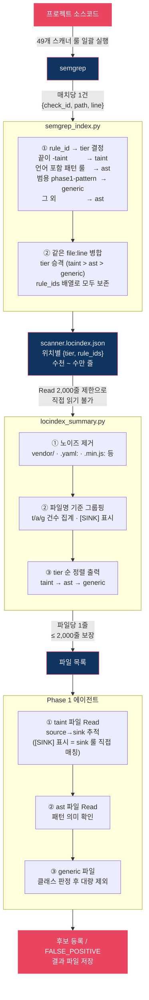

# noah-8719

> Claude Code 보안 분석 플러그인. 49개 취약점 스캐너 + AI 자율 탐색으로 정적 분석 + 동적 테스트 + 보고서 생성.

## 설치

```bash
git clone https://github.com/nomarlhack/noah-claude-plugin.git noah-8719
claude --plugin-dir ./noah-8719
```

| 항목 | 조건 |
|------|------|
| Claude Code | 최신 버전 |
| Python 3 | 보고서 생성/검증에 필요 |

```bash
cd noah-8719 && git pull   # 업데이트
```

## 사용법

```
/noah-8719:sast
```

> `sast`, `소스코드 취약점 스캔` 등으로도 트리거됩니다.

## 개요

Noah SAST는 Claude Code의 **스킬(Skill)** 위에서 동작하는 소스코드 취약점 분석 프레임워크입니다. 49개 전용 스캐너와 AI 자율 탐색을 결합해 **정적 분석 → 동적 검증 → 보고서 생성**까지 한 번에 수행합니다.

전체 파이프라인은 네 묶음으로 이어집니다.

1. **준비** (Step 1–4) — 무엇을·어디를 스캔할지 정하고 코드베이스를 한 번만 인덱싱합니다.
2. **Phase 1 · 정적 분석** (Step 5–7) — 스캐너와 AI가 코드를 읽어 취약점 후보를 찾고 1차로 거릅니다.
3. **Phase 2 · 동적 검증** (Step 8–11) — 실제 페이로드를 보내 후보가 진짜 악용 가능한지 확인합니다.
4. **보고서** (Step 12) — 확정된 결과를 사람이 읽을 문서로 조립합니다.

세 가지 설계 원칙이 이 구조를 떠받칩니다.

- **단일 진실 원천** — 모든 상태는 `master-list.json` 한 파일에만 기록되고, 각 필드는 정해진 한 주체만 씁니다.
- **오탐·미탐 저항** — 최종 판정은 탐색 에이전트가 아닌 **독립된 리뷰 에이전트**가 내립니다(blind eval). 정적 주장과 동적 증거가 충돌하면 **항상 동적 증거를 따릅니다**.
- **최소 개입** — 사용자 입력이 꼭 필요한 지점 외에는 자동으로 수렴합니다.

## 실행 흐름

```mermaid
flowchart TD
    User["사용자: /noah-8719:sast"] --> S1["Step 1: 실행 경로 확정"]
    S1 --> S2["Step 2: 패턴 인덱싱"]
    S2 --> S3["Step 3: 프로젝트 스택 파악"]
    S3 --> S4["Step 4: 스캐너 선별\n(다국어 의존성 + AI 검토)"]
    S4 --> S5["Step 5: 정적 분석\n(그룹 병렬 → 파일 저장)"]
    S5 --> BML2["phase1_build_master_list.py\n결과 검증 + master-list.json"]
    BML2 --> S6["Step 6: AI 자율 분석\n(내부 3단계)"]
    S6 --> MLUpdate2["master-list.json 갱신\n(Phase 1 + AI 후보 통합)"]
    MLUpdate2 --> S7["Step 7: 정적·AI 리뷰\n(phase1-review, blind eval)"]
    S7 -->|DISCARD| ML_Safe["status: safe\n(Phase 2 낭비 방지)"]
    S7 -->|CONFIRM / OVERRIDE| Check{후보 발견?}
    ML_Safe --> Check
    Check -->|0건| S12["Step 12: 보고서 생성"]
    Check -->|1건+| S81["Step 8-1: 동적 테스트 정보 요청\n(URL_PROVIDED + ATTACK_CONSENT 분리)"]
    S81 --> S82["Step 8-2: 도구 권한 확인"]
    S82 --> AttackCheck{ATTACK_CONSENT\n동적 공격 동의?}

    AttackCheck -->|Yes| LLMCheckY{LLM 그룹 활성?}
    LLMCheckY -->|Yes| S83Full["Step 8-3: LLM endpoint probe\nprobe_mode = full"]
    LLMCheckY -->|No| S84Plain["Step 8-4: Phase 2 실행"]
    S83Full --> S84Mixed["Step 8-4: Phase 2 실행 (Tier A/B/C 병렬)"]

    AttackCheck -->|No| LLMCheckN{LLM 그룹 활성?}
    LLMCheckN -->|Yes| S83Lite["Step 8-3: LLM endpoint probe\nprobe_mode = connectivity-only / static-only"]
    LLMCheckN -->|No| S12
    S83Lite --> S12

    S84Plain --> S9["Step 9: 동적 분석 리뷰\n(phase2-review)"]
    S84Mixed --> S9
    S9 -->|불일치 감사 로그| Conflicts["phase1_eval_state.conflicts\n(append-only)"]
    Conflicts --> ChainCheck
    S9 --> ChainCheck{"안전 제외\n후보 2건+?"}
    ChainCheck -->|Yes| S10["Step 10: 연계 분석"]
    ChainCheck -->|No| S11
    S10 --> S11["Step 11: 결과 검증"]
    S11 --> S12
    S12 --> ReviewCheck{"후보 1건+?"}
    ReviewCheck -->|Yes| Review["Step 12-1: report-review"]
    ReviewCheck -->|No| Finalize
    Review --> Finalize["Step 12-2: report_finalize.py"]

    style User fill:#e94560,stroke:#e94560,color:#fff
    style S6 fill:#e94560,stroke:#e94560,color:#fff
    style MLUpdate2 fill:#0f3460,stroke:#e94560,color:#eee
    style S7 fill:#0f3460,stroke:#e94560,color:#eee
    style S9 fill:#0f3460,stroke:#e94560,color:#eee
    style Review fill:#0f3460,stroke:#e94560,color:#eee
    style Conflicts fill:#0f3460,stroke:#e94560,color:#eee
    style ML_Safe fill:#533483,stroke:#533483,color:#fff
    style S10 fill:#533483,stroke:#533483,color:#fff
    style Finalize fill:#e94560,stroke:#e94560,color:#fff
    style Check fill:#533483,stroke:#533483,color:#fff
    style ChainCheck fill:#533483,stroke:#533483,color:#fff
    style ReviewCheck fill:#533483,stroke:#533483,color:#fff
    style AttackCheck fill:#533483,stroke:#533483,color:#fff
    style LLMCheckY fill:#533483,stroke:#533483,color:#fff
    style LLMCheckN fill:#533483,stroke:#533483,color:#fff
```



## 단계별 설명

### 준비 (Step 1–4)

**Step 1 · 실행 경로 확정**
스캔 대상 경로와 결과 저장 디렉토리를 정합니다. 중단된 스캔이 있으면 이어서 진행할지 판단합니다.

**Step 2 · 패턴 인덱싱**
코드베이스 전체를 한 번만 훑어 각 스캐너의 semgrep 룰이 매치되는 위치를 미리 색인합니다(`semgrep_index.py`). 결과는 `locindex.json`(위치별 tier·rule_ids)으로 저장되고, Phase 1 에이전트는 이를 `locindex_summary.py`를 통해 파일 목록으로 변환해 받습니다. 상세 내용은 [인덱싱 · Phase 1 상세](skills/sast/docs/indexing-and-phase1.md) 참조.



**Step 3 · 프로젝트 스택 파악**
언어·프레임워크·인증 방식·DB 종류·프록시 구성 등 모든 스캐너가 공통으로 필요한 프로젝트 정보를 수집합니다.

**Step 4 · 스캐너 선별**
49개 스캐너 중 이 프로젝트에 해당하는 것만 고릅니다(`select_scanners.py`). AI가 한 번 더 검토해 놓친 스캐너를 복원합니다. **"포함이 기본, 제외에는 근거가 필요"** 원칙으로 동작합니다.

### Phase 1 · 정적 분석 (Step 5–7)

**Step 5 · 정적 분석**
선별된 스캐너를 그룹으로 묶어 병렬 실행합니다. 각 스캐너는 Step 2 색인을 기반으로 위험 지점(sink)과 입력 출처(source)를 추적해 취약점 후보를 찾습니다. `phase1_build_master_list.py`가 결과를 검증해 `master-list.json`을 만듭니다.

**Step 6 · AI 자율 분석**
스캐너가 구조적으로 놓치기 쉬운 취약점(비즈니스 로직 결함, 인가 흐름, Race Condition 등)을 AI가 코드를 직접 읽으며 탐색합니다. 발견한 후보는 `master-list.json`에 통합됩니다.

**Step 7 · phase1-review**
독립된 리뷰 에이전트가 "후보 사유"를 보지 않은 채 코드와 증거만으로 전 후보를 재판정합니다(blind eval). 판정 결과는 CONFIRM(유지 → Phase 2 진입), OVERRIDE(내용 수정 후 유지), DISCARD(`safe` 처리 → Phase 2 생략) 세 가지입니다.

### Phase 2 · 동적 검증 (Step 8–11)

> 후보가 없으면 Phase 2를 건너뛰고 보고서(Step 12)로 갑니다.

**Step 8 · 동적 분석**
- **8-1** — 테스트 URL과 공격 동의(ATTACK_CONSENT)를 사용자에게 묻고 대기합니다.
- **8-2** — curl·Playwright 등 도구 권한을 확인합니다.
- **8-3** — LLM 스캐너 그룹이 활성이면 endpoint probe를 먼저 실행합니다(full / connectivity-only / static-only 자동 선택).
- **8-4** — 스캐너를 Tier A/B/C로 나눠 병렬로 동적 테스트를 수행합니다.

**Step 9 · phase2-review**
동적 증거를 해석해 각 후보의 최종 상태(`confirmed`/`candidate`/`safe`)를 확정합니다. 정적·동적 불일치는 `conflicts` 감사 로그에만 기록합니다.

**Step 10 · 연계 분석**
`safe` 판정을 제외한 후보가 2건 이상이면, 개별로는 낮은 위험이라도 연결 시 실제 공격이 되는 체인을 구성해 영향을 재평가합니다.

**Step 11 · 결과 검증**
최종 상태와 증거의 정합성을 점검합니다.

### 보고서 (Step 12)

**Step 12 · 보고서 생성**
`safe`로 분류된 항목도 왜 안전한지(safe 분류 6종)와 함께 별도 섹션으로 남깁니다.
- **12-1 report-review** — 보고서 본문의 설명·스니펫·PoC를 다듬습니다(판정 불변).
- **12-2** — `report_finalize.py`가 HTML 변환 → 검증 → 열기를 한 번에 처리합니다.

## Phase 1 후보 분류 (Safe-by-Proof)

Phase 1이 매치 한 건을 후보 또는 안전으로 분류하는 방법입니다. 여섯 층을 차례로 통과하는 깔때기 구조이며, **정탐을 안전으로 잘못 떨구는 미탐 방지**에 초점이 있습니다.

세 가지 원칙이 이 구조를 관통합니다.

> 1. **입증책임 역전** — 모든 매치를 일단 "취약"으로 간주하고, "안전"으로 분류하려면 증거를 제시해야 합니다.
> 2. **삭제 대신 순위 매기기** — "안전"으로 분류해도 목록에서 지우지 않습니다.
> 3. **비대칭** — 후보로 남기는 비용은 낮게, 안전으로 단정하는 비용은 높게 설계했습니다.

### 여섯 층

```
semgrep 매치 → [1]tier 분기 → [2]의무 판정 → [3]볼륨 전수처리
             → [4]관례 일탈 → [5]블라인드 재판정 → [6]기계 게이트
```

**[1] tier 자동 분기** — semgrep 탐지 방식으로 신뢰도 3등급 분류 (Step 2 다이어그램 참조).

**[2] 의무 모델 O1~O4** — "안전"으로 분류하려면 네 의무를 모두 증거로 충족해야 합니다.

| 의무 | 충족 조건 | 미충족 시 |
|------|-----------|----------|
| O1 입력 비제어 | 입력이 상수·내부 생성·검증된 값 | 후보 유지 |
| O2 도달 가능성 | sink가 진입점에서 도달 불가 | 후보 유지 |
| O3 정화 처리 | 유효한 정화가 모든 경로를 커버 | 후보 유지 |
| O4 위험성 | 해당 위치가 실제 위험 지점이 아님 | 후보 유지 |

**[3] 볼륨 전수 처리** — 수만 건이라도 한 건도 빠짐없이 설명해야 합니다. `eval`·`innerHTML`처럼 그 자체로 위험한 토큰은 묶어서 버릴 수 없습니다.

**[4] 관례 일탈 신호** — 대부분은 방어가 있는데 일부만 빠졌다면, 그 예외는 신뢰도 높은 후보입니다(대표: `IDOR_ASYMMETRIC`).

**[5] 블라인드 재검토** — 독립된 에이전트가 Phase 1의 "후보 사유"를 보지 않고 코드와 증거만으로 재판정합니다.

**[6] 기계 게이트** (`phase1_review_assert.py`, 위반 시 exit 7 차단) — 커버리지 감사·의무 감사·taint-safe 감지 세 가지를 검사합니다.

> **두 종류의 보장이 직렬로 작동합니다.** [1][3][6]은 기계가 강제하는 완전성, [2][4][5]는 모델이 판단하는 정확성을 담당합니다.

### 스캐너 유형별 적용

**A. 능력형 (6개)** — 매치 자체가 위험 동작의 존재를 뜻합니다. 게이트가 전수 판정을 강제합니다.

| 스캐너 | taint 룰 | sink 룰 | 게이트 방식 |
|--------|----------|---------|-----------|
| command-injection | 4 | 5 | sink 룰 매치 집계 |
| xss | 4 | 2 (js/ts) | sink 룰 매치 집계 |
| ssti | 3 | 3 | sink 룰 매치 집계 |
| dom-xss | 1 | 2 (js/ts) | sink 룰 매치 집계 |
| code-injection | 3 | — | ast 전체 집계 (eval·assert) |
| deserialization | 3 | — | ast 전체 집계 (readObject) |

**B. 부재형** — "있어야 할 검증이 빠졌는가"를 탐지합니다.

| 스캐너 | 판별 방법 |
|--------|----------|
| idor | taint 룰 + `idor_inventory.py` + 관례 일탈 신호 |
| csrf | `protect_from_forgery` 예외 추적 |
| business-logic / validation-logic | 코드 의미 분석 (상태 전이, 대량 할당) |

**C. 주입형** — taint 위주, 위험한 형태(문자열 보간·연결)만 후보로 올립니다.

**D. 나머지 (~30개)** — 패턴·generic 룰과 공통 층으로 검토합니다. 설정 점검형이 많습니다.

## 판정 결과 모델

최종 상태는 `master-list.json`의 `status` 필드로 결정되며, **`scan-report-review` 서브스킬이 단일 writer**입니다.

### status 3종

| status | 의미 | 결정 시점 |
|--------|------|----------|
| `confirmed` | 동적 테스트로 취약점 실증 | phase2-review |
| `candidate` | 동적 검증 미완·차단·생략 | phase1-review / phase2-review |
| `safe` | 방어 또는 영향도 부재로 폐기 | phase1-review / phase2-review |

### safe 분류 6종

| 값 | 정의 |
|----|------|
| `no_external_path` | 공격자가 해당 코드로 요청을 보낼 수 없음 |
| `defense_verified` | 페이로드 전송 시 방어 코드가 실제 차단 |
| `not_applicable` | 공격 경로는 있으나 핵심 요건 부재 |
| `false_positive` | 지적한 코드가 실제로는 취약점 sink가 아님 |
| `platform_default_defense` | 브라우저·런타임·표준이 동등 방어 제공 |
| `architectural_rationale_only` | 다른 후보 경로 증명용 (자체 조치 대상 아님) |

### candidate 태그

| 우선순위 | tag | 의미 |
|---------|-----|------|
| 1 | `LLM endpoint 미확보` | LLM probe 실패 |
| 2 | `LLM endpoint 정적 식별` | 동적 호출 없음 |
| 3 | `LLM endpoint 확인됨` | 공격 페이로드 미시도 |
| 4 | `동적 분석 생략` | 사용자가 동적 테스트 거부 |
| 5 | `차단` | WAF 등이 모든 변형 차단 |
| 6 | `환경 제한` | sandbox 제한으로 수행 불가 |
| 7 | `도구 한계` | curl/Playwright 실패 |
| 8 | `정보 부족` | 필요 정보 없어 검증 미완 |

### 핵심 판정 원칙

- **Source 도달성** — *"외부 행위자가 이 값을 의도적으로 다르게 만들 방법이 존재하는가?"*
- **부재 주장** — "검증 없음"을 주장하려면 sink ±30줄 + 호출자 체인 + 전역 필터까지 실제 확인.
- **Phase 2 우선** — 정적·동적 증거 충돌 시 항상 동적 증거로 확정. 불일치는 감사 로그로만 기록.
- **blind eval** — 리뷰 에이전트는 "후보 사유"를 보지 않고 독립 판정.
- **단일 writer** — 각 필드는 정해진 한 주체만 씁니다. 권한 위반은 assert 스크립트가 차단.

## 스캐너 목록

| # | 스캐너 | 취약점 유형 | 그룹 |
|---|--------|-----------|------|
| 1 | xss-scanner | Cross-Site Scripting | url-navigation |
| 2 | dom-xss-scanner | DOM-based XSS | url-navigation |
| 3 | open-redirect-scanner | Open Redirect | url-navigation |
| 4 | crlf-injection-scanner | CRLF Injection | response-header |
| 5 | host-header-scanner | Host Header Attack | response-header |
| 6 | http-method-tampering-scanner | HTTP Method Tampering | response-header |
| 7 | sqli-scanner | SQL Injection | db-query |
| 8 | nosqli-scanner | NoSQL Injection | db-query |
| 9 | command-injection-scanner | OS Command Injection | process-execution |
| 10 | code-injection-scanner | Code Injection | process-execution |
| 11 | ssti-scanner | Server-Side Template Injection | process-execution |
| 12 | ssrf-scanner | Server-Side Request Forgery | server-request |
| 13 | pdf-generation-scanner | PDF Generation SSRF/LFI | server-request |
| 14 | path-traversal-scanner | Path Traversal / LFI | file-system |
| 15 | file-upload-scanner | Unrestricted File Upload | file-system |
| 16 | zipslip-scanner | Zip Slip | file-system |
| 17 | xxe-scanner | XML External Entity | xml-serialization |
| 18 | xslt-injection-scanner | XSLT Injection | xml-serialization |
| 19 | deserialization-scanner | Insecure Deserialization | xml-serialization |
| 20 | jwt-scanner | JWT Tampering | auth-protocol |
| 21 | oauth-scanner | OAuth Authentication Bypass | auth-protocol |
| 22 | saml-scanner | SAML Authentication Bypass | auth-protocol |
| 23 | csrf-scanner | Cross-Site Request Forgery | auth-protocol |
| 24 | idor-scanner | Insecure Direct Object Reference | auth-protocol |
| 25 | redos-scanner | Regular Expression DoS | client-rendering |
| 26 | css-injection-scanner | CSS Injection | client-rendering |
| 27 | prototype-pollution-scanner | Prototype Pollution | client-rendering |
| 28 | http-smuggling-scanner | HTTP Request Smuggling | infra-config |
| 29 | sourcemap-scanner | Source Map Exposure | infra-config |
| 30 | subdomain-takeover-scanner | Subdomain Takeover | infra-config |
| 31 | security-headers-scanner | Security Headers (CSP, CORS, HSTS 등) | infra-config |
| 32 | springboot-hardening-scanner | Spring Boot Hardening | infra-config |
| 33 | tls-scanner | TLS/SSL Misconfiguration | infra-config |
| 34 | csv-injection-scanner | CSV / Formula Injection | data-export |
| 35 | graphql-scanner | GraphQL Vulnerabilities | protocol-check |
| 36 | websocket-scanner | WebSocket Vulnerabilities | protocol-check |
| 37 | soapaction-spoofing-scanner | SOAPAction Spoofing | protocol-check |
| 38 | ldap-injection-scanner | LDAP Injection | protocol-check |
| 39 | xpath-injection-scanner | XPath Injection | protocol-check |
| 40 | cookie-security-scanner | Cookie Security | auth-protocol |
| 41 | business-logic-scanner | Business Logic Vulnerabilities | business-logic |
| 42 | validation-logic-scanner | Validation Logic Mismatch | business-logic |
| 43 | prompt-injection-scanner | LLM Prompt Injection | llm |
| 44 | system-prompt-leakage-scanner | LLM System Prompt Leakage | llm |
| 45 | insecure-output-handling-scanner | LLM Insecure Output Handling | llm |
| 46 | unbounded-consumption-scanner | LLM Unbounded Consumption | llm |
| 47 | android-deeplink-scanner | Android Deeplink / WebView | mobile |
| 48 | hardcoded-secrets-scanner | Hardcoded Credentials / API Keys | secrets-logging |
| 49 | log-injection-scanner | Log Injection | secrets-logging |

## 디렉토리 구조

```
noah-8719/
├── .claude-plugin/
│   └── plugin.json                      # 플러그인 매니페스트
├── install.sh / uninstall.sh
├── skills/
│   └── sast/
│       ├── SKILL.md                     # 오케스트레이터 (Step 1~12 상세)
│       │
│       ├── scanners/                    # 49개 취약점 스캐너
│       │   ├── xss-scanner/
│       │   │   ├── phase1.md            # Sink 의미론, 판정 기준
│       │   │   ├── phase2.md            # 동적 테스트 cheat sheet
│       │   │   └── rules/               # semgrep 룰 (pattern.*.yaml, taint.*.yaml, sink.*.yaml)
│       │   ├── sqli-scanner/            # (동일 구조)
│       │   └── ... (47개 추가)
│       │
│       ├── prompts/                     # 에이전트 지시 문서
│       │   ├── guidelines-phase1.md     # Phase 1 공통 지침 (Safe-by-Proof, 커버리지 감사)
│       │   ├── guidelines-phase2.md     # Phase 2 공통 지침 (동적 테스트 절차)
│       │   ├── decision-framework.md    # 후보 판정 의사결정 (tier 분기, 의무 모델)
│       │   ├── phase1-group-agent.md    # Phase 1 그룹 에이전트 지시
│       │   ├── phase2-agent.md          # Phase 2 에이전트 지시
│       │   ├── ai-discovery-agent.md    # AI 자율 탐색 에이전트 지시
│       │   └── llm-endpoint-probe-agent.md  # LLM endpoint probe 지시
│       │
│       ├── tools/                       # Python 유틸리티
│       │   ├── semgrep_index.py         # semgrep 실행 → locindex.json 생성
│       │   ├── locindex_summary.py      # locindex.json → 파일 목록 요약 (Phase 1 입력)
│       │   ├── select_scanners.py       # 스캐너 선별 + 그룹 편성
│       │   ├── phase1_build_master_list.py  # Phase 1 결과 검증 + master-list.json 생성
│       │   ├── phase1_review_assert.py  # Phase 1 리뷰 게이트 (exit 7로 차단)
│       │   ├── phase1_review_blind_read.py  # blind eval 헬퍼
│       │   ├── phase1_resume.py         # 중단된 Phase 1 재개 지점 판별
│       │   ├── phase2_review_assert.py  # Phase 2 리뷰 게이트
│       │   ├── phase2_actuator_check.py # Phase 2 액추에이터 확인
│       │   ├── idor_inventory.py        # IDOR taint 원장 생성
│       │   ├── llm_channel_probe.py     # LLM 채널 어댑터 (HTTP/ws/SSE)
│       │   ├── lint_reader_layer.py     # 보고서 용어 린트
│       │   └── report_finalize.py       # 보고서 최종 검증·변환·열기
│       │
│       ├── sub-skills/
│       │   ├── scan-report/             # 보고서 생성
│       │   │   ├── SKILL.md
│       │   │   ├── vuln-format.md
│       │   │   ├── assemble_report.py
│       │   │   ├── md_to_html.py
│       │   │   ├── validate_report.py
│       │   │   └── validate_links.py
│       │   ├── scan-report-review/      # 평가·리뷰 (3모드)
│       │   │   ├── SKILL.md
│       │   │   ├── phase1-review.md
│       │   │   ├── phase2-review.md
│       │   │   ├── report-review.md
│       │   │   ├── _principles.md
│       │   │   └── _contracts.md
│       │   └── chain-analysis/          # 공격 체인 연계 분석
│       │       ├── SKILL.md
│       │       └── chain-construction-rules.md
│       │
│       ├── docs/                        # 상세 문서
│       │   ├── indexing-and-phase1.md   # semgrep 인덱싱 · Phase 1 분석 상세
│       │   ├── pipeline.md
│       │   ├── review-modes.md
│       │   ├── single-source-of-truth.md
│       │   ├── scanner-authoring-guide.md
│       │   └── resume.md
│       │
│       └── tests/
│           ├── source-reachability/     # source 도달성 회귀 테스트
│           └── tools/                   # 유틸리티 단위 테스트
└── README.md
```

