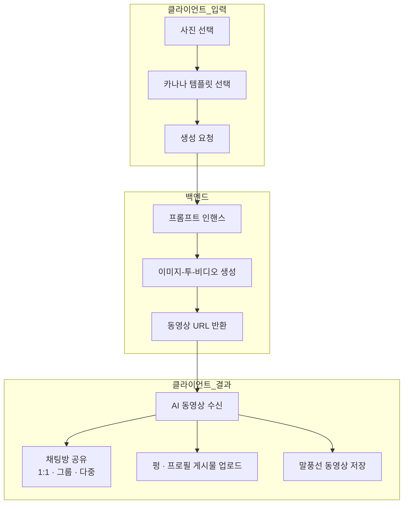

# 프로젝트 개요

카나나 템플릿을 기반으로 AI 동영상을 만들고 채팅방에 공유하거나 펑·게시물에 업로드하고, 채팅방에 공유된 말풍선 동영상은 저장할 수도 있습니다. 사용자는 사진과 템플릿을 고르기만 하면 되고, 뒤에서는 프롬프트를 자동으로 다듬고 이미지를 동영상으로 변환하는 AI 파이프라인이 돌아갑니다. 클라이언트는 창작·공유·저장 경험을, 백엔드는 AI 동영상 생성과 템플릿·프롬프트 운영을 담당합니다.

---

## 흐름도

## 역할 요약

- **클라이언트** — 사용자 창작·공유·저장 경험 (템플릿 선택, 공유, 펑/게시물, 말풍선 저장)
- **백엔드** — AI 동영상 생성 파이프라인과 템플릿·프롬프트 운영
