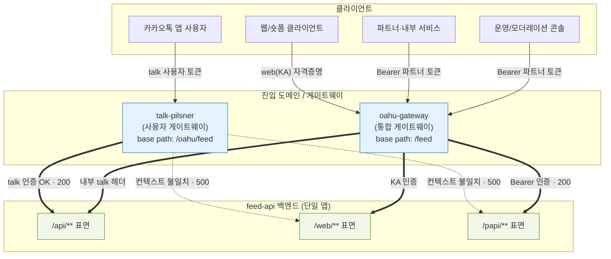
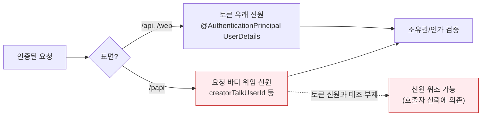

# 인증 경계 맵 (Authentication Boundary Map)

이 문서는 feed-api가 노출하는 HTTP 표면을 **진입 도메인(게이트웨이) × 표면(경로) × 자격증명 × 신원 출처** 관점에서 정리한다. 정적 분석(소스/설정)과 동적 검증(sandbox 호출)을 결합해 도출했으며, **확정/추정/미확정**을 구분한다.

> 범례: **실선** = 정상 인증·도달 확인, **점선** = 게이트웨이는 통과하나 백엔드에서 컨텍스트 불일치로 실패(500).

---

## 1. 진입 경로 — 도메인 × 표면 × 자격증명

핵심: **두 게이트웨이의 인증 체계가 분리**되어 있고, 한쪽에서 막힌 표면이 다른 쪽에서 열린다. `talk-pilsner`는 `/api`만 정상이고 `/web`·`/papi`는 백엔드에서 500이다. `/papi`는 `oahu-gateway` + Bearer 토큰으로만 실제 동작한다.

---

## 2. 신원 출처 — 표면별 사용자 식별 값의 출처

핵심: `/api`·`/web`은 신원을 **토큰에서** 도출하지만, `/papi`는 **요청 바디 값**으로 행위자를 지정한다(파트너 위임 모델). papi 핸들러에 "토큰 신원 == 바디 신원" 대조가 없으면 호출자가 임의 신원으로 동작할 수 있다 — papi 표면의 인가 위험의 근원.

---

## 3. 도메인 × 표면 도달성 매트릭스 (동적 검증)

| 표면 \ 도메인 | `talk-pilsner` (talk 토큰) | `oahu-gateway` (표면별 자격증명) |
|---|---|---|
| **/api** | ✅ 200 (정상) | ✅ 내부 talk 헤더 |
| **/web** | ❌ 500 (web 컨텍스트 필요) | ✅ KA 자격증명 |
| **/papi** | ❌ 500 (Bearer 컨텍스트 필요) | ✅ Bearer 200 (확인됨) |
| 무인증 / 잘못된 토큰 | 401 | 401 |

---

## 4. 표면 요약

| 표면 | 자격증명 | 신원 출처 | 진입 도메인 |
|------|---------|----------|------------|
| `/api/**` | talk 사용자 토큰 | 토큰 (`@AuthenticationPrincipal`) | talk-pilsner (`/oahu/feed`) |
| `/web/**` | web(KA) 자격증명 | 토큰 (`@AuthenticationPrincipal`) | oahu-gateway (`/feed`) |
| `/papi/**` | Bearer 파트너 토큰 | 요청 바디 위임 (`creatorTalkUserId`) | oahu-gateway (`/feed`) |

---

## 5. 추정 / 미확정 (정직성)

- **확정**: 위 도달성 매트릭스(동적 호출로 status 확인), `/papi`=Bearer/바디위임(소스 + 동적), base path 매핑.
- **추정**: prod 환경의 게이트웨이별 정확한 base path 변환(게이트웨이 인프라 설정은 repo 밖).
- **미확정 (repo 외부)**: 표면별 "경로 → 자격증명 강제 규칙"은 인증이 외부 라이브러리/게이트웨이에 위임되어 있어 소스만으로 확정 불가. 위 매핑은 정적 클라이언트 산출물 + 동적 검증으로 보강한 결과이며, 게이트웨이의 실제 강제 규칙은 별도 인프라 설정에 있다.

> **주의**: 이 맵은 특정 시점의 sandbox 관측에 기반한다. 배포본과 소스 트리가 다를 수 있으며(일부 라우트는 소스에 있으나 배포본에 부재), 운영(prod) 게이트웨이의 표면 노출 경계는 별도 확인이 필요하다.
