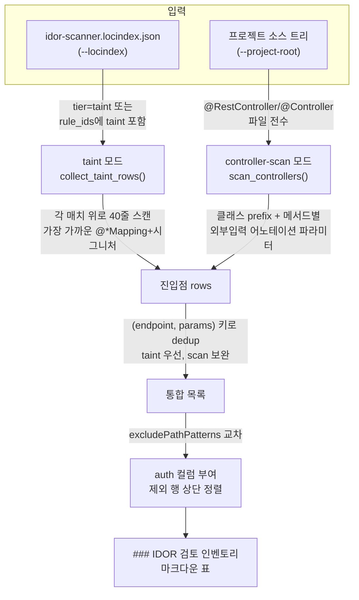

# IDOR 검토 인벤토리 생성기 (`idor_inventory.py`)

IDOR 점검 대상 진입점(외부 식별자를 받아 리소스에 접근하는 엔드포인트)을 **기계적으로 전수 수집**하는 인벤토리 생성기다. 취약/안전을 **판정하지 않는다** — "빠짐없이 목록화"가 유일한 책임이며, 소유권게이트 판정([검증]/[부재])은 에이전트가 service Read로 채운다.

## 왜 필요한가

IDOR은 "있어야 할 인가 검증의 **부재**"라 단일 패턴 자동 판정이 어렵다(넓으면 FP 폭발, 좁으면 미탐). 그래서 idor-scanner는 진입점을 ①자동 후보 ②검토 후보 ③검토 인벤토리 3단계로 나누는데, 이 도구는 **③ 전수 인벤토리**를 담당한다.

에이전트가 수기로 진입점을 훑으면 대량(실측 700~1150건+)에서 일부를 컨텍스트 한계로 누락한다. 이 도구는 그 FN(놓침)을 막는 **백스톱**이자, DAST 권한 diff의 입력 목록이다. "외부 식별자 수용 엔드포인트 중 안 본 것은 없다"를 기계적으로 보장한다.

## 역할 경계 — 한다 / 안 한다

| 한다 | 안 한다 |
|------|---------|
| 외부 입력 어노테이션을 가진 모든 진입점 전수 추출 | 취약/안전 판정 (소유권게이트는 `[미확인]`로 초기화) |
| HTTP verb·경로·파라미터·위치 수집 | service/AOP 계층 소유권 검증 유무 확인 |
| 인증 게이트 미경유 경로 표시(`auth` 컬럼) | 게이트 부재 시 후보 등록(에이전트/phase1.md 정책의 몫) |
| taint·controller-scan 두 소스 통합·dedup | 데이터플로우 추적(그건 semgrep taint 룰의 몫) |

`[미확인]` 컬럼을 채워 [검증](게이트+범위 적정)/[부재](게이트 없음)/[부분](부분 게이트)로 승격하는 것은 **에이전트가 코드를 직접 Read**해서 수행한다. 도구는 "여기 봐야 한다"까지만 책임진다.

## 두 입력 모드



- **taint 모드** (`--locindex`): idor-scanner의 locindex에서 `missing-owner-gate-taint` 매치(외부입력→리소스접근 흐름이 dataflow로 확정된 위치)를 추출한다. semgrep taint 엔진이 처리한 **고신뢰** 신호다.
- **controller-scan 모드** (`--project-root`): `.java`/`.kt`(Spring)·`.py`(FastAPI·Django)·`.js`/`.ts`(Express) 컨트롤러/라우트에서 외부 식별자를 받는 진입점을 source-only로 전수 추출한다. taint flow가 엔진 한계(람다 클로저·체이닝·DTO 필드)로 닿지 못하는 진입점을 메우는 **안전망(FN 방지)**이다.

둘 다 제공하면 합쳐서 dedup하고 출처를 표시한다(`taint` / `controller-scan` / `taint+scan`). 어느 한쪽만 줘도 동작한다.

## 사용법

```bash
# 두 모드 병행 (권장 — FN 0에 가장 가까움)
python3 <NOAH_SAST_DIR>/tools/idor_inventory.py \
  --locindex <PATTERN_INDEX_DIR>/idor-scanner.locindex.json \
  --project-root <PROJECT_ROOT> \
  --out <PHASE1_RESULTS_DIR>/_idor_inventory_raw.txt

# taint 모드만 (Spring·FastAPI 외 프레임워크 — controller-scan 미지원 시)
python3 <NOAH_SAST_DIR>/tools/idor_inventory.py --locindex <locindex> --out <md>

# controller-scan 모드만 (locindex 없을 때)
python3 <NOAH_SAST_DIR>/tools/idor_inventory.py --project-root <root> --out <md>
```

`--out` 생략 시 stdout으로 출력한다. (하위 호환: 첫 positional 인자도 `--locindex`로 받음.)

> **대용량 인벤토리를 `PHASE1_RESULTS_DIR`에 별도 저장할 때는 `_` 접두사를 붙인다**(예: `_idor_inventory_raw`). `phase1_build_master_list.py`는 `_` 접두사 파일을 후보 manifest 수집에서 제외하므로, 인벤토리(수백 행)를 스캐너 결과 파일과 분리해도 master-list 빌드가 후보로 오인하지 않는다.

## 출력 형식

```
### IDOR 검토 인벤토리 (기계 생성)

taint 매치 N건(...) | 컨트롤러 source-only 스캔 M건 | → dedup 후 K 엔드포인트.

| # | 엔드포인트 | 외부입력(파라미터) | 위치 | 출처 | 인증 | 소유권게이트 |
|---|---|---|---|---|---|---|
| 1 | GET /public/v1/.../e-tickets | bookingPriceUnitId(@PathVariable String) | PublicBookingController.java:26 | taint+scan | [제외] | [미확인] |
```

| 컬럼 | 의미 |
|------|------|
| 엔드포인트 | `HTTP verb + 경로` (클래스 prefix 결합) |
| 외부입력(파라미터) | `이름(@어노테이션 타입)` 목록. 외부 입력 어노테이션 7종으로 식별 |
| 위치 | `파일명:라인` |
| 출처 | `taint`=dataflow 확정(고신뢰) / `controller-scan`=source-only 진입점(안전망) / `taint+scan`=양쪽 |
| **인증** | `[제외]`=인증 게이트 미경유(우선 검토) / `[적용]`=그 외(단정 아님) / `[미상]`=미발견·미지원 |
| 소유권게이트 | **항상 `[미확인]`으로 초기화** — 에이전트가 service Read 후 채움 |

> **에이전트가 소유권게이트를 채우는 규칙** (phase1.md):
> - `[검증] <service>.<method>():<file:line>` — 완전 검증. 게이트 함수의 파일·라인 인용 필수.
> - `[부재]` — service Read 후 게이트 없음 확정.
> - `[부분]: <우회 경로>` — 부분 게이트(타입/분기 예외 등).
> - **게이트 호출 존재만으로 `[검증]` 금지** — 범위 적정성까지 확인. 다른 항목 게이트를 추정 복사 금지.

## 동작 상세

### taint 모드 — 컨텍스트 추출 (`extract_context`)
locindex에서 taint 위치(`file:line`)를 받아, 해당 라인에서 **위로 최대 40줄**을 역방향 스캔해 가장 가까운 `@*Mapping` 어노테이션을 찾는다. 거기서 HTTP verb·경로를 읽고, 매핑 아래 최대 16줄(멀티라인 시그니처 대응)에서 외부 입력 어노테이션 파라미터를 추출한다.

### controller-scan 모드 — 시그니처 파싱 (`_scan_controller_file`)
1. `@RestController`/`@Controller` 마커가 없는 파일은 스킵.
2. 클래스 선언 주변에서 클래스 레벨 `@RequestMapping` prefix를 추출.
3. 각 메서드 매핑 어노테이션을 앵커로, 아래 메서드 시그니처를 찾아(다른 어노테이션 `@Valid` 등은 통과) **괄호 깊이를 세어 시그니처 끝까지만** 캡처(다음 메서드 침범 방지).
4. **경로변수(라우트의 `{var}`)와 외부 입력 어노테이션 파라미터가 둘 다 없을 때만 제외**(식별자 미수용 = IDOR 대상 아님). 경로변수는 시그니처 어노테이션과 무관하게 라우트 문자열에서 직접 추출하므로, `@PathVariable`이 누락돼도 경로변수가 있으면 등재된다 — controller-scan은 입력 추출 성패가 아니라 **라우트 전수 열거**가 목적이기 때문이다.
5. `build`/`out`/`target`/`.gradle`/`.idea`/`node_modules`/`test` 디렉토리는 순회에서 제외.

**외부 입력 어노테이션 7종** (신뢰 경계 — 특정 이름 카탈로그 금지, 어노테이션 자체가 표지):
`@PathVariable` · `@RequestParam` · `@RequestBody` · `@RequestHeader` · `@CookieValue` · `@ModelAttribute` · `@RequestPart`

### FastAPI 모드 — 시그니처 파싱 (`_scan_fastapi_file`)
Python `.py`에서 라우트 데코레이터(`@router.get("/x")` 등)를 앵커로 아래 `def`/`async def` 시그니처를 찾아, 외부 입력 의존성(`Path`/`Query`/`Body`/`Header`/`Cookie`/`Form`/`File` 기본값) + 경로 변수(`{var}`)를 추출한다. Pydantic 본문 모델(`body: ItemModel`)은 타입만으로 판별이 어려워 보수적으로 제외하며(오탐 방지), 본문 모델로 들어오는 식별자는 taint 모드가 커버한다.

### Express 모드 — 라우트 열거 (`_scan_express_file`)
본문접근형이라 시그니처 파싱이 안 통하므로 **라우트 전수 열거**에 집중한다. `app/router.METHOD('/path', ...)` 호출(경로가 `/`로 시작하는 것만 — `Map.get('key')` 등 오탐 방지)을 라우트로 잡고, 경로변수(`:var`)는 정확히 추출한다(완전성). 입력은 best-effort: 라우트 줄부터 다음 라우트 등록 전까지(최대 25줄) 본문의 `req.(params|query|body|headers|cookies)` 토큰을 힌트로 단다. 등재 기준은 **경로변수 OR 입력힌트**이며, 인라인 핸들러(`=>`/`function`)인데 둘 다 없으면 제외(예: `/health`), 외부 핸들러(`app.get('/x', ctrl.show)`)는 본문을 못 보므로 `<입력 미상 - 핸들러 Read>`로 등재해 에이전트가 핸들러를 Read하게 한다. **한계**: 마운트 prefix(`app.use('/api', sub)`)·동적/변수 라우트는 경로가 부정확하거나 미상으로 남는다.

### Django 모드 — urls.py 라우트 열거 (`_scan_django_urls_file`)
라우트(`urls.py`)와 핸들러(`views.py`)가 분리된 구조라 **항상 외부 핸들러 패턴**이다. `urlpatterns = ` 할당을 필수 마커로 삼고(주석/문자열의 `urlpatterns` 언급·소문자 `path()` 호출 오탐 방지), `path()`/`re_path()`/`url()`의 경로 + 경로변수(`<int:id>`/`<slug:key>` 및 `(?P<id>...)`)를 추출한다. `include()`는 sub-urls 마운트라 제외(해당 sub `urls.py`가 따로 스캔됨). 핸들러가 `views.py`에 있어 입력은 경로변수가 없으면 `<입력 미상 - view Read>`로 등재하고, HTTP 메서드는 뷰가 결정하므로 `ANY`로 표기한다. **한계**: DRF `router.register`·CBV 자동 메서드·마운트 prefix는 미반영(미상/누락 가능). 또한 스캐너 도구 자신(이 스킬)의 코드는 `_SKILL_ROOT` 하위로 스캔에서 제외되어 자기참조 오탐을 막는다.

### dedup과 정렬
`(endpoint, params)` 키로 중복 제거. taint가 먼저 들어오면 유지하고 scan은 출처만 합산(`taint+scan`). 정렬 우선순위: **① 인증 `[제외]` 먼저 → ② taint 출처 먼저 → ③ 엔드포인트 사전순**. 인증 미경유 진입점이 표 상단에 모여 우선 검토 큐가 된다.

### 인코딩 fallback
`utf-8 → euc-kr → cp949 → iso-8859-1` 순으로 시도한다. 한국어 레거시 코드베이스(EUC-KR 등)의 컨트롤러도 누락 없이 읽기 위함이다.

## 인증 게이트 미경유 탐지 (`auth` 컬럼)

인증 인터셉터/시큐리티가 **인증 대상에서 제외한 경로**의 진입점을 표시한다. 인증 게이트를 거치지 않는 진입점일수록 애플리케이션 레벨 소유권 검증이 더 중요한데(인증이 없으니까), 이들이 `[미확인]`로 방치되어 후보 승격이 누락되는 것을 막기 위한 우선순위 신호다.

**동작**:
1. `collect_auth_excluded_patterns()` — 프로젝트 전체에서 `excludePathPatterns(...)` 블록(멀티라인 포함) 안의 경로 리터럴을 수집(`build`/`.gradle` 제외).
2. `_ant_to_regex()` — Spring Ant 패턴을 정규식으로 변환(`**`=임의·슬래시 포함, `*`=단일 세그먼트, `{var}`=단일 세그먼트).
3. `auth_label()` — 각 진입점 경로(verb 제거·선행 슬래시 정규화)가 제외 패턴에 매칭되면 `[제외]`, 아니면 `[적용]`, 패턴 미수집 시 `[미상]`.

**phase1.md 정책과의 연결**: `auth=[제외]` + 보호 대상 리소스 접근 진입점은 phase1.md의 *"인증 게이트 미경유 진입점은 [미확인]로 종결 금지"* 규칙에 따라 service Read로 [검증]/[부재] 확정하고, 확정 불가 시 보수적으로 후보(`IDOR_GATE_UNVERIFIED`)로 승격한다. **인증 부재 자체는 안전 근거가 아니다.**

## 한계와 확장

- **controller-scan은 Spring(Java/Kotlin)·FastAPI(Python)·Express(Node.js)·Django(Python)를 지원**한다. Spring·FastAPI는 데코레이터+시그니처에서 라우트·입력을 정확히 추출한다. Express는 본문접근형이라 **라우트+경로변수는 정확히 전수 열거하고 입력은 best-effort 힌트**(인라인 핸들러 본문 `req.*` 토큰), 외부 핸들러는 `<입력 미상 - 핸들러 Read>` 마커로 등재한다. Django는 라우트(`urls.py`)와 핸들러(`views.py`)가 분리되어 **라우트+경로변수만 열거하고 입력은 거의 미상**(`<입력 미상 - view Read>`)이다. Flask·Rails·Go는 아직 미지원이라 **taint 모드만** 동작하며, 그 갭은 에이전트 source-first 보완이 백스톱이다.
- **`auth` 컬럼은 Spring `excludePathPatterns`만 지원**한다(FastAPI 등 타 프레임워크는 `[미상]`). 인증 미경유 판정이 `[미상]`인 경우 phase1.md 정책(인증 미경유 진입점 [미확인] 종결 금지)이 백스톱이며, 에이전트가 라우팅/시큐리티 설정을 직접 Read해 판정한다.
- `auth` 컬럼은 **근사치**다: 프로젝트 전체의 `excludePathPatterns`를 합집합으로 보고 매칭하므로, 인터셉터별 세분(어떤 인터셉터가 어떤 경로를 제외)이나 `addPathPatterns`(특정 경로만 적용)는 반영하지 않는다. `[제외]`만 확신 신호이고, `[적용]`은 단정이 아니다.
- 다른 프레임워크 확장 시 `scan_controllers`에 그 언어의 매핑·시그니처 휴리스틱을, `collect_auth_excluded_patterns`에 그 프레임워크의 인증 제외 표지(예: Django `AllowAny`/`@csrf_exempt`, Express 미들웨어 미적용, FastAPI `Depends` 미부착)를 어댑터로 추가한다.

## 관련 문서·테스트

- `scanners/idor-scanner/phase1.md` — 3단계 분류, 소유권게이트 채움 규칙, 인증 미경유 [미확인] 종결 금지 정책, 프레임워크 확장 메타 원칙.
- `docs/indexing-and-phase1.md` — locindex 생성(이 도구의 taint 모드 입력).
- `tests/tools/test_idor_inventory_auth.py` — `auth` 컬럼·Ant 매칭·제외 패턴 수집 회귀 테스트.
