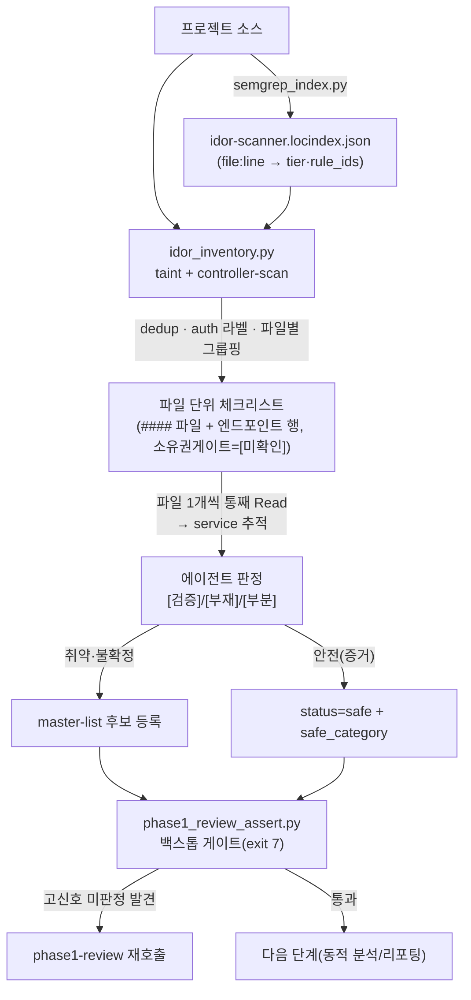

# IDOR 스캔 설명서 — 인덱싱부터 Phase 1 정·오탐 판별까지

IDOR(Insecure Direct Object Reference / BOLA) 점검이 raw 코드에서 Phase 1 후보(취약/안전) 판정까지 어떻게 진행되는지의 end-to-end 설명서다. 단계별 산출물·역할·판정 규칙을 다룬다. 각 단계의 세부 명세는 관련 문서(하단 §7)를 참조한다.

## 0. 왜 IDOR는 다른 취약점과 다른가

대부분의 취약점은 "위험한 코드의 **존재**"(예: `eval(user_input)`)라 단일 패턴으로 탐지된다. IDOR은 반대로 **"있어야 할 인가 검증의 부재"**다. 부재는 단일 패턴으로 잡기 어렵다 — 넓게 잡으면 FP가 폭발하고, 좁게 잡으면 미탐(FN)이 난다. 게다가 소유권 검증은 어느 계층(컨트롤러/서비스/쿼리/AOP/게이트웨이)에서든, 어떤 관용구로든 구현될 수 있고, **같은 구문이 검증하기도 안 하기도** 한다.

그래서 IDOR 스캔은 **3계층 분업**으로 설계된다:

| 계층 | 책임 | 누가 |
|------|------|------|
| **열거(완전성)** | 외부 식별자를 받는 모든 진입점을 빠짐없이 목록화 | 기계(`idor_inventory.py`) |
| **판정(의미)** | 각 진입점이 소유권 게이트를 갖는지 판단 | 에이전트(파일 단위 검토) |
| **백스톱(누락 차단)** | 고신호 패턴이 판정 없이 샜는지 검사 | 기계(`phase1_review_assert.py`) |

핵심 원칙: **기계는 "무엇을 빠짐없이 볼지"와 "안 본 게 있는지"를 담당하고, 의미 판정 자체는 에이전트가 한다.** 기계가 정·오탐을 대신 결정하지 않는다.

## 1. 전체 흐름



## 2. 단계 0 — 인덱싱 (semgrep → locindex)

`semgrep_index.py`가 idor-scanner 룰을 프로젝트에 일괄 실행해 `idor-scanner.locindex.json`을 만든다. 위치(`file:line`)별로 `{tier, rule_ids}`가 기록된다(tier: taint > ast > generic).

IDOR 룰은 두 종류다:
- **taint 룰**(`rules/taint.<lang>.yaml`, `noah-*-idor-missing-owner-gate-taint`): 외부 식별자(source)가 자원 접근 호출(sink)로 흐르되 일반 소유권 sanitizer를 거치지 않는 dataflow를 매치. 고신뢰지만, 코드베이스 고유의 쿼리-레벨 소유권 관용구는 sanitizer로 못 잡아 over-match가 많다(그래서 후속 판정이 필요).
- **pattern 룰**(`rules/pattern.<lang>.yaml`): `*-idor-session-identity-override`(클라↔세션 신원 폴백 고정밀 시그널), `*-idor-phase1-pattern`(컨트롤러 진입점 broad 매치) 등.

> 세부: `docs/indexing-and-phase1.md`.

## 3. 단계 1 — 인벤토리 생성 (`idor_inventory.py`): 파일 단위 체크리스트

raw 매치(수천~수만)는 그대로 검토할 수 없다. 인벤토리 생성기가 이를 **진입점 단위로 정리**하고 **검토 단위인 파일로 묶는다.**

동작:
1. **taint 모드**(`--locindex`): locindex의 missing-owner-gate 매치 위치에서 가장 가까운 라우트 매핑·시그니처를 추출.
2. **controller-scan 모드**(`--project-root`): 컨트롤러/라우트 파일에서 외부 입력 어노테이션 7종(`@PathVariable`/`@RequestParam`/`@RequestBody`/`@RequestHeader`/`@CookieValue`/`@ModelAttribute`/`@RequestPart`)을 가진 진입점을 source-only로 전수 추출(taint가 못 닿는 진입점을 메우는 안전망).
3. 두 모드를 `(endpoint, params)` 키로 **dedup**(출처 `taint`/`controller-scan`/`taint+scan`).
4. `excludePathPatterns`로 **`인증` 컬럼**(`[제외]`=인증 미경유 / `[적용]` / `[미상]`) 부여.
5. **진입점 파일별로 그룹핑** → `#### <파일>` 섹션 + 그 파일의 엔드포인트 체크리스트. **`[제외]` 포함 파일을 상단 정렬**(우선 검토).

출력 형태(합성 예시):
```
#### <Controller>.<ext>  — 엔드포인트 2개 · 인증 미경유 1개

| 확인 | 엔드포인트 | 외부입력(파라미터) | 위치 | 출처 | 인증 | 소유권게이트 |
|---|---|---|---|---|---|---|
| [ ] | GET /public/v1/{parentId}/items/{itemId} | itemId(@PathVariable) | <Controller>.<ext>:NN | taint+scan | [제외] | [미확인] |
| [ ] | GET /v1/items/{itemId}             | itemId(@PathVariable) | <Controller>.<ext>:MM | taint     | [적용] | [미확인] |
```

`소유권게이트`는 **`[미확인]`으로 초기화**된다 — 판정은 다음 단계에서 에이전트가 채운다. 체크리스트(`확인` 칸)는 한 파일 안의 어떤 진입점도 빠뜨리지 않게 하는 완전성 장치다.

> 세부: `docs/idor-inventory.md`.

## 4. 단계 2 — Phase 1 파일 단위 검토 (정·오탐 판별의 핵심)

**검토 단위는 파일이다**(일반 phase1의 파일 단위 디스패치와 동일). 엔드포인트 행을 따로따로 보지 않고, 각 `#### <파일>` 블록을 통째로 Read한다. `[제외]` 포함 파일부터 처리한다.

각 파일에서:
1. 파일을 통째 Read하여 sibling 메서드·import·공유 service를 한 컨텍스트로 파악.
2. 각 엔드포인트가 호출하는 **service/도메인 계층까지 따라가** 소유권 검증 유무를 확인.
3. 체크리스트의 **모든** 엔드포인트의 `소유권게이트`를 채운다(누락 금지).

### 판정 어휘

| 판정 | 의미 | 형식 |
|------|------|------|
| `[검증]` | 완전 검증 — 호출자 신원으로 자원 접근이 적정하게 스코프됨 | `[검증] <service>.<method>():<file:line>` (게이트 함수 위치 인용 필수) |
| `[부재]` | service Read 후 소유권 게이트 없음 확정 | `[부재]` |
| `[부분]` | 부분 게이트(타입/분기 예외, 일부 액션만 등) | `[부분]: <우회 경로>` |
| `[미확인]` | 아직 판정 안 됨 | (종착 상태로 두면 안 됨 — 아래 규칙) |

### 정·오탐 판별 규칙

- **소유권 게이트의 정의**: "자원 접근이 **호출자 신원**(세션/인증 주체)으로 스코프되거나, 호출자와 자원 소유자의 일치가 강제되는가." 구현 계층·관용구는 불문(쿼리 술어, equals 비교, 예외 throw, 정책 엔진 등 모두 가능).
- **존재 ≠ 적정**: 게이트 함수가 호출됐다는 사실만으로 `[검증]` 금지. 함수 본문을 Read해 **범위 적정성**까지 확인한다. (신원 인자가 전달돼도 그 결과가 접근을 **거부**하지 않으면 게이트가 아니다.)
- **복사 금지**: 같은 모듈의 다른 항목 판정을 추정으로 복사하지 않는다. 각 항목은 해당 service를 직접 Read.
- **인증 미경유(`[제외]`)는 `[미확인]` 종결 금지**: 인증 게이트를 안 거치고 도달하는 진입점이 소유권 개념이 있는 자원에 접근하면, `[미확인]`로 남기지 말고 [검증]/[부재]로 확정한다. 확정 불가 시 보수적으로 후보 승격. **인증 부재 자체는 안전 근거가 아니다** — 오히려 애플리케이션 레벨 소유권 검증의 필요성을 높인다.
- **deviance(지역 관례 일탈) = 고신뢰 신호**: 형제 진입점 다수가 소유권 게이트를 갖는데 소수만 누락했다면, 그 소수는 HIGH-confidence 후보다. 다수의 안전성이 일탈자의 안전성을 증명하지 않는다.
- **영향은 sink가 실제로 하는 일로만 기술**: 조회형이면 응답으로 직렬화되는 실제 필드, 변경형이면 실제 상태 변화로 한정. 엔드포인트 의미·worst-case로 외삽하지 않는다.

> 판정 원칙 세부: `scanners/idor-scanner/phase1.md`, `prompts/decision-framework.md`.

## 5. 단계 3 — 후보 등록 / 안전 폐기

판정 결과를 master-list에 반영한다:
- `[부재]`/`[부분]`/불확정 → **후보 등록**(status=candidate). 동적 검증(DAST)에서 "안전"이 입증되지 않는 한 최종 보고서에 포함된다.
- `[검증]`(안전) → master-list에 `status=safe` + **`safe_category`**(안전 사유 분류) 기재. 사유 없는 safe는 금지.

## 6. 단계 4 — 기계 백스톱 (`phase1_review_assert.py`)

에이전트가 예산 압박으로 고신호 진입점을 판정 없이 넘기면, 백스톱 게이트가 **exit 7로 차단**한다. 두 게이트는 공통 계약을 따르며, "고신호 진입점이 **결말지어졌는가**"를 본다(판정이 *맞는지*는 보지 않음). 결말 인정 기준은 **취약점 발견은 master-list 등록, 안전 판정만 인벤토리 `[검증]` 텍스트** — `[부재]`/`[부분]`(취약/부분 판정)은 등록 없이 인벤토리 라벨만으로는 해소로 보지 않는다(보고서는 master-list만 렌더하므로 미등록 발견은 누락되기 때문).

| 게이트 | 신호 | 입력 |
|--------|------|------|
| `_session_override_audit` | 신원이 클라(`@RequestParam`)와 세션(`@RequestHeader`)의 null-폴백으로 해석되는 고정밀 매치 | locindex |
| `_unauth_nested_resource_audit` | 인증 미경유(`[제외]`) + path-variable 2개 이상(중첩 자원 `/{parent}/.../{child}`) | 인벤토리 |

**게이트가 못 잡는 것**(정직한 한계):
- 판정이 거짓인 경우(손은 댐 — 별도 층인 taint-safe tripwire 등이 일부 담당).
- 의미적 변종 — 신원 식별자가 소비되나 거부하지 않는 decoy, 단일 식별자 추측형 IDOR 등.
→ 이들은 **파일 단위 검토(1차) + DAST(동적 권한 diff)**가 백스톱이다. 게이트는 1차 방어가 아니라 *고신호 슬라이스의 조용한 누락*을 막는 2차 그물이다.

> exit 7 감사군 전체: `sub-skills/scan-report-review/_contracts.md §2`. 게이트 세부: `docs/idor-inventory.md`.

## 7. 인벤토리의 이중 역할

인벤토리는 Phase 1 이후에도 쓰인다:
- **완전성 백스톱**: "외부 식별자 수용 진입점 중 안 본 것은 없다"의 기계적 보장.
- **DAST 입력(권한 diff worklist)**: 동적 단계에서 각 진입점을 *교차 신원 테스트*(사용자 A의 자원을 사용자 B/무인증으로 호출 → 응답이 같으면 IDOR)로 검증할 때, 인벤토리가 전수 테스트 목록이 된다. 정적에서 `[미확인]`/`[부분]`으로 남은 것도 동적 단계가 빠짐없이 재확인한다.

## 8. 관련 문서

- `docs/indexing-and-phase1.md` — 인덱싱(locindex 생성)과 일반 phase1 파일 단위 디스패치.
- `docs/idor-inventory.md` — `idor_inventory.py` 명세, 프레임워크별 어댑터, 백스톱 게이트 2종.
- `scanners/idor-scanner/phase1.md` — IDOR 판정 규칙(3계층 분류, 소유권게이트 채움, 인증 미경유 종결 금지 정책).
- `prompts/decision-framework.md` — 영향 서술·deviance·rank-don't-drop 등 전 스캐너 공통 판정 원칙.
- `sub-skills/scan-report-review/_contracts.md` — exit code(감사군) 및 master-list 필드 계약.
