# semgrep 인덱싱과 Phase 1 분석

## 전체 흐름

```mermaid
flowchart TD
    SRC["프로젝트 소스코드"]
    SRC -->|"47개 스캐너 룰 일괄 실행"| SEMGREP["semgrep"]
    SEMGREP -->|"매치당 1건\n{check_id, path, line}"| IDX

    subgraph IDX ["semgrep_index.py"]
        direction TB
        A1["① rule_id → tier 결정\nnoah-java-xss-taint          → taint\nnoah-xss-phase1-pattern      → generic\nnoah-java-xss-phase1-pattern → ast\nnoah-java-xss-sink-pattern   → ast"]
        A2["② 같은 file:line 병합\ntier 승격 (taint > ast > generic)\nrule_ids 배열로 모두 보존"]
        A1 --> A2
    end

    IDX --> LOC["scanner.locindex.json\n위치별 {tier, rule_ids}\n수천 ~ 수만 줄"]

    LOC -->|"Read 2,000줄 제한으로\n직접 읽기 불가"| SUM

    subgraph SUM ["locindex_summary.py"]
        direction TB
        B1["① 노이즈 제거\nvendor/ · .yaml: · .min.js: 등"]
        B2["② 파일명 기준 그룹핑\nt/a/g 건수 집계 · [SINK] 표시"]
        B3["③ tier 순 정렬 출력\ntaint → ast → generic"]
        B1 --> B2 --> B3
    end

    SUM -->|"파일당 1줄\n≤ 2,000줄 보장"| LIST["파일 목록"]

    LIST --> P1["Phase 1 에이전트"]

    subgraph P1 ["Phase 1 에이전트"]
        direction TB
        C1["① [SINK] 파일 Read → sink 코드 확인"]
        C2["② taint 파일 Read → source→sink 추적"]
        C3["③ ast 파일 Read → 패턴 의미 확인"]
        C4["④ generic 파일 → 클래스 판정"]
        C1 --> C2 --> C3 --> C4
    end

    P1 --> OUT["후보 등록 / FALSE_POSITIVE\n결과 파일 저장"]

    style SRC fill:#e94560,stroke:#e94560,color:#fff
    style SEMGREP fill:#0f3460,stroke:#e94560,color:#eee
    style LOC fill:#0f3460,stroke:#e94560,color:#eee
    style LIST fill:#0f3460,stroke:#e94560,color:#eee
    style OUT fill:#e94560,stroke:#e94560,color:#fff
```



---

## semgrep 인덱싱

### semgrep이 만드는 결과

semgrep은 룰이 매칭될 때마다 다음 정보를 반환합니다.

```json
{
  "check_id": "noah-javascript-xss-phase1-pattern",
  "path": "/path/to/NowRender.js",
  "start": {"line": 22},
  "extra": {
    "lines": "this.$nowList.append(jQuery(list.map((item) => {"
  }
}
```

`semgrep_index.py`는 이 결과를 받아서 스캐너별로 두 파일로 가공합니다.

---

### 생성되는 파일

**`<scanner>.json` — 룰별 위치 목록**

룰 ID를 키로, 해당 룰이 매칭된 위치 목록을 값으로 저장합니다.

```json
{
  "noah-javascript-xss-phase1-pattern": ["NowRender.js:22", "B.Profile.js:296", ...],
  "noah-java-spring-xss-taint":         ["ArticleController.java:313", ...]
}
```

**`<scanner>.locindex.json` — 위치별 매칭 정보**

같은 위치에 여러 룰이 걸리면 1개로 합칩니다. tier는 셋 중 가장 높은 것으로 승격하고, 어떤 룰들이 걸렸는지는 `rule_ids`에 모두 남깁니다.

```json
{
  "_scanner": {
    "name": "xss-scanner",
    "has_taint": true,
    "tier_counts": {"taint": 379, "ast": 3310, "generic": 1049}
  },
  "locations": {
    "NowRender.js:22": {
      "tier": "ast",
      "rule_ids": ["noah-javascript-xss-phase1-pattern", "noah-xss-phase1-pattern"]
    },
    "ArticleController.java:313": {
      "tier": "taint",
      "rule_ids": ["noah-java-spring-xss-taint"]
    }
  }
}
```

---

### tier 의미

tier는 semgrep이 어떤 방식으로 매칭했는지를 나타냅니다. 룰 ID 이름으로 자동 결정됩니다.

| tier | 판정 기준 | 예시 rule ID | 의미 |
|------|-----------|-------------|------|
| `taint` | 끝이 `-taint` | `noah-java-xss-taint` | dataflow 분석으로 source→sink 흐름 확정. 신뢰도 최고 |
| `generic` | 끝이 `-phase1-pattern`이고 언어 없음 | `noah-xss-phase1-pattern` | 범용 정규식 매칭. 언어 무관, 노이즈 많음. 신뢰도 최저 |
| `ast` | 끝이 `-phase1-pattern`이고 언어 있음, 또는 그 외 모두 | `noah-java-xss-phase1-pattern`, `noah-java-xss-sink-pattern` | 언어 파서로 구문 매칭. 위치는 정확하나 source·sanitizer는 미확인 |

"언어 있음"이란 rule ID 두 번째 토큰이 `java`, `javascript`, `python`, `kotlin` 등 언어 이름인 경우입니다.

---

### 파일 크기 문제

`locindex.json`은 매칭 건수에 비례해 커집니다.

| 스캐너 | 매칭 건수 | locindex 줄 수 |
|--------|-----------|----------------|
| xss-scanner | 4,738건 | 36,861줄 |
| idor-scanner | 5,370건 | 39,705줄 |
| unbounded-consumption | 8,788건 | 66,129줄 |
| **전체 합계** | **66,910건** | — |

Read 도구는 기본 2,000줄 제한이 있습니다. 에이전트가 직접 Read하면 JSON이 잘려 파싱에 실패합니다. 이 문제를 해결하기 위해 `locindex_summary.py`를 사용합니다.

---

## locindex_summary.py

### 하는 일

`locindex.json`을 읽어 **파일 단위로 묶어** 요약합니다.

1. 노이즈 경로 제거 — `vendor/`, `.min.js:`, `.yaml:` 등 실제 프로젝트 코드가 아닌 파일
2. 남은 항목을 파일명 기준으로 그룹핑
3. 파일별 best_tier / taint·ast·generic 건수 집계
4. `-sink` 또는 `-taint` 룰이 걸린 파일에 `[SINK]` 표시
5. 정렬: taint → ast → generic 순, 동 tier 내 taint 건수 내림차순
6. stdout 출력 (파일 저장 없음)

파일 수는 매칭 건수보다 훨씬 적어서, **47개 스캐너 모두 2,000줄 이내가 보장**됩니다.

### 출력 예시

```
=== xss-scanner 매칭 파일 요약 ===
총 4738건 → 실제 3824건 / 노이즈 제거 914건
tier: taint=379  ast=3310  generic=1049
파일 수: 510개

best_tier    t     a     g  파일명
----------------------------------------------------------------------
taint       39   140     0  ArticleController.java [SINK]  (3개 경로)
taint       31    22     0  EventController.java [SINK]
...
ast          0     2     0  B.Sign.SignupConfirm.js [SINK]
ast          0     1     0  NowRender.js
...
generic      0     0     2  DonateSuccessModal.svelte

[노이즈 제거] 914건 — vendor/min/YAML/룰파일
```

Phase 1 에이전트는 이 출력을 보고 어느 파일을 먼저 Read할지 결정합니다.

### 실행 방법

```bash
python3 <NOAH_SAST_DIR>/tools/locindex_summary.py \
  <PATTERN_INDEX_DIR>/<scanner-name>.locindex.json
```

---

## Phase 1 분석

### 분석 순서

파일 목록을 받은 에이전트는 우선순위에 따라 파일을 Read합니다.

**1) `[SINK]` 파일 — 먼저 확인**

sink 룰이 직접 매칭된 파일입니다. `innerHTML`, `.html($Y)` 등 실제 위험 함수가 있는 파일이므로 가장 먼저 봅니다.

```
B.Sign.SignupConfirm.js [SINK]
  → $userNameError.html(r.responseJSON.desc) 확인
  → source 추적: r.responseJSON.desc = 서버 하드코딩 메시지
  → FALSE_POSITIVE
```

**2) `best_tier=taint` 파일 — source→sink 흐름 확인**

semgrep이 dataflow 분석으로 흐름을 확정한 파일입니다.

```
ArticleController.java  (taint 39건)
  → @RequestParam String title 확인 (source)
  → DB 저장 → /v1/article/recent → NowRender.js 경로 추적
  → NowRender.js: jQuery.append(template_literal) 확인 (sink)
  → 방어 코드 없음 → XSS-1 후보 등록
```

**3) `best_tier=ast` 파일 — 패턴 의미 확인**

파일당 1회 Read해서 실제 sink인지 판단합니다. 대부분은 `@RequestParam` 선언부(source이지 sink 아님)라 FALSE_POSITIVE로 처리됩니다.

**4) `best_tier=generic` 파일 — 클래스 판정**

정규식 매칭이라 노이즈가 많습니다. "이 파일들은 전부 Svelte `{value}` 보간 — 자동 escape" 같은 클래스 판정으로 묶어서 제외할 수 있습니다.

```
DonateSuccessModal.svelte  (generic 2건)
  → {@html title} 확인 — Svelte raw HTML 렌더링 (generic이어도 실제 sink)
  → source 추적: articleTitle → DonationCommentCompleteMessage → title
  → XSS-2 후보 등록
```

**5) Source-first 추가 탐색**

locindex에 없는 파일에서 취약 패턴을 grep으로 직접 탐색합니다. semgrep이 놓친 경로를 보완합니다.

**6) 영향(impact) grounding — sink 실제 효과 확인**

방어(게이트) 유무를 확인할 때 sink의 **실제 효과**도 함께 봅니다(영향축 대칭 — `guidelines-phase1.md §9-A` / `decision-framework §2-D 원칙 4`): 조회형이면 응답으로 직렬화되는 구조의 노출 필드를, 변경·부수효과형이면 일으키는 상태 변화·부수 효과를 근거로 영향을 적습니다. 엔드포인트 의미·형제 취약점·worst-case로 외삽하지 않고, 정적 확인 불가분은 "효과 미확인"으로 표기합니다(과장도, 미확인을 "안전"으로 닫는 과소평가(FN)도 금지). 실측 교훈: IDOR-3가 배송 추적 응답 DTO를 읽지 않고 "배송 PII"로 외삽한 과장.

---

### COVERAGE 감사

매칭이 200건을 넘는 스캐너는 전체 건수를 어떻게 처리했는지 결과 파일에 기록해야 합니다. `phase1_review_assert.py` 게이트가 이를 검증하고, 설명되지 않은 잔여가 있으면 exit 7로 차단합니다.

```
<!-- COVERAGE matches=4738 accounted=4738
     method="taint 379건 전수 분석 / sink JS 380건(vendor 52 제외, 2건 후보) /
             generic 1049건(Svelte 자동 escape) / 노이즈 914건" -->
```

---

## 관련 파일

| 파일 | 역할 |
|------|------|
| `tools/semgrep_index.py` | semgrep 실행 → locindex.json 생성 |
| `tools/locindex_summary.py` | locindex.json → 파일 목록 요약 |
| `tools/phase1_review_assert.py` | COVERAGE 감사 게이트 + session-override 룰 매치 등록 게이트(미등록 = 고신뢰 IDOR 누락, exit 7) |
| `prompts/phase1-group-agent.md` | Phase 1 에이전트 지시 (§3 Bash 실행 방법) |
| `prompts/guidelines-phase1.md` | Phase 1 분석 공통 지침 (§6-A-1 locindex 사용법) |
