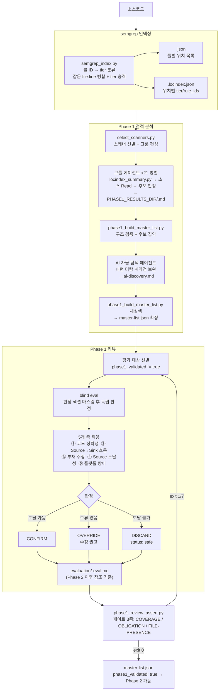

# Phase 1 흐름

소스코드를 정적 분석하여 취약점 **후보**를 만들고, 리뷰로 정제하는 단계다. semgrep 인덱싱 → 그룹 에이전트 분석 → AI 자율 탐색 → Phase 1 리뷰 순으로 진행되며, 결과는 `master-list.json`으로 집약된다.

---

## 전체 흐름



---

## 1단계: semgrep 인덱싱

### 왜 인덱싱이 필요한가

21개 그룹 에이전트가 병렬로 실행된다. 각 에이전트가 소스코드를 직접 스캔하면 같은 파일을 21번 스캔하는 낭비가 생기고, 에이전트마다 결과가 달라질 수 있다. **스캔을 1회만 실행해 인덱스로 저장**하고 각 에이전트가 인덱스를 읽는 구조다.

### 출력 파일 2종

**`<scanner>.json`** — 룰 ID를 키로, 매칭된 위치 목록을 값으로 저장

```json
{
  "noah-javascript-xss-phase1-pattern": ["render.js:22", "profile.js:296"],
  "noah-java-xss-taint":                ["ArticleController.java:313"]
}
```

**`<scanner>.locindex.json`** — 같은 `file:line`에 여러 룰이 걸리면 1개로 병합. tier는 가장 높은 것으로 승격하고 `rule_ids`에 모두 보존

```json
{
  "_scanner": {
    "name": "xss-scanner",
    "has_taint": true,
    "tier_counts": { "taint": 379, "ast": 3310, "generic": 1049 }
  },
  "locations": {
    "render.js:22": { "tier": "ast", "rule_ids": ["noah-javascript-xss-phase1-pattern"] },
    "ArticleController.java:313": { "tier": "taint", "rule_ids": ["noah-java-xss-taint"] }
  }
}
```

| 파일 | 키 | 용도 |
|------|----|------|
| `<scanner>.json` | 룰 ID | 특정 룰의 매치 위치 조회 |
| `<scanner>.locindex.json` | file:line | Phase 1 에이전트가 tier 순서로 분석할 파일 목록 파악 |

### tier — 매칭 신뢰도

룰 ID 이름으로 자동 결정된다.

| tier | 결정 기준 | 의미 |
|------|----------|------|
| taint | rule ID가 `-taint`로 끝남 | dataflow로 source→sink 확정. 신뢰도 최고 |
| ast | `-phase1-pattern`으로 끝나고 언어 prefix 있음, 또는 그 외 | 언어 파서로 구문 매칭. 위치는 정확하나 source·sanitizer 미확인 |
| generic | `-phase1-pattern`으로 끝나고 언어 prefix 없음 | 범용 정규식. 노이즈 많음. 신뢰도 최저 |

"언어 prefix"란 rule ID 두 번째 토큰이 `java`, `javascript`, `typescript`, `python`, `kotlin`, `go`, `ruby`, `php`, `csharp`, `scala` 중 하나인 경우다.

### 주요 처리 세부사항

- **UTF-8 미러**: EUC-KR 등 비-UTF8 파일을 임시 디렉토리에 UTF-8로 변환 후 스캔하고 경로를 원본으로 복원
- **PHP 단일 스레드**: semgrep PHP 분석기는 병렬 스캔에서 비결정적이므로 PHP 전용 룰은 `-j 1`로 별도 실행
- **코드 확장자 필터**: `.ts`, `.js`, `.java` 등 약 80종만 스캔 (`.png`, `.lock` 등 무관 파일 차단)
- **스킬 디렉토리 자동 제외**: SAST 도구 자체 코드가 결과에 섞이지 않도록 자동 제외

### exit code

stdout에 `run_semgrep_index_exit=N`으로 출력한다.

| exit | 의미 | 조치 |
|------|------|------|
| 0 | 모든 스캐너 정상 처리 | Phase 1 진행 |
| 1 | semgrep CLI 부재 또는 경로 오류 | semgrep 설치 후 재실행 |
| 2 | 부분 실패 — `_semgrep_failures.json` 참조 | 실패 스캐너는 빈 `{}` 인덱스, 나머지는 정상 진행 |

---

## 2단계: Phase 1 정적 분석

### 그룹 에이전트 (병렬)

`select_scanners.py`가 편성한 그룹당 1개 에이전트를 병렬 디스패치한다.

각 에이전트의 작업:

```
① locindex_summary.py 실행
     → 노이즈(vendor/, .min.js, .yaml 등) 제거
     → 파일당 1줄 요약 (taint/ast/generic 건수)

② 스캐너 phase1.md 읽기
     → Sink 의미론, Source 패턴, 판정 기준 숙지

③ taint → ast → generic 순서로 소스 파일 Read
     → Source → Sink 흐름 추적
     → 후보 / FALSE_POSITIVE / NO_PATH 판정

④ 결과 MD 작성
     → 게이트 주석 (COVERAGE / OBLIGATION / FILE-PRESENCE)
     → 후보 섹션 + MANIFEST 블록
```

**결과 파일**: `<PHASE1_RESULTS_DIR>/<scanner>.md`

### locindex_summary.py

`locindex.json`은 매칭 건수에 비례해 수만 줄이 되는 경우가 있다. Read 도구의 2,000줄 제한 때문에 에이전트가 직접 읽으면 JSON이 잘려 파싱 실패한다. `locindex_summary.py`가 파일 단위로 묶어 2,000줄 이내로 요약한다.

```
=== xss-scanner 매칭 파일 요약 ===
총 4738건 → 실제 3824건 / 노이즈 제거 914건
파일 수: 510개

best_tier    t     a     g  파일명
----------------------------------------------------------------------
taint       39   140     0  ArticleController.java [SINK]
ast          0     2     0  render.js [SINK]
generic      0     0     2  Modal.svelte
```

### AI 자율 탐색

패턴으로 잡히지 않는 취약점을 보완한다.

```
1단계: 자유 탐색 (인증 흐름, 비즈니스 로직, Race Condition 등)
2단계: Phase 1 공백 영역 집중 (이상 없음 스캐너가 다루지 않은 영역)
3단계: 미탐색 파일/디렉토리 집중
```

**결과 파일**: `ai-discovery.md`

### phase1_build_master_list.py

그룹 에이전트 + AI 탐색 완료 후 전체 후보를 집약하고 구조를 검증한다.

- MANIFEST `declared_count` == 실제 `## ID:` 헤더 수
- 필수 섹션 존재 및 최소 길이
- 동일 file:line 후보 중복 감지

**출력**: `master-list.json` — Phase 2 ~ 보고서까지의 단일 진실 원천

---

## 3단계: Phase 1 리뷰

Phase 1 에이전트는 **Sink 패턴 매칭** 중심으로 분석한다. 리뷰는 **Source 역추적** 중심으로 독립 재판정해 부정확한 후보를 Phase 2 전에 정제한다.

### blind eval

리뷰 에이전트가 Phase 1의 결론을 먼저 읽으면 편향이 생긴다. `phase1_review_blind_read.py`가 판정 섹션(`### Decision`, `### 판정 요약` 등)을 마스킹하면, 리뷰 에이전트는 마스킹된 뷰만 보고 독립 판정한다.

### 5개 판정 축

| 축 | 확인하는 것 |
|----|-----------|
| ① 코드 스니펫 정확성 | Phase 1이 인용한 코드가 실제 파일·라인에 존재하는가 (±5줄 허용) |
| ② Source→Sink 흐름 | Phase 1이 기술한 각 단계를 실제 코드에서 추적 가능한가 |
| ③ 부재 주장 검증 | "~가 없다"라는 주장을 코드 Read로 직접 확인 |
| ④ Source 도달성 | 사용자 입력이 실제로 sink까지 닿는가 (tier별 분기) |
| ⑤ 플랫폼 방어 | 브라우저·런타임·HTTP 표준이 이미 방어하고 있는가 |

축 ④의 tier별 처리:

| tier | 처리 방식 |
|------|----------|
| taint | dataflow가 확정됨 → 역추적 생략, sink 의미론만 확인 |
| ast / generic | Source→Sink 전체 역추적 수행 |

### 판정 3종

| 판정 | 의미 | master-list.json 결과 |
|------|------|----------------------|
| CONFIRM | Phase 1 판정 타당 | `phase1_validated: true` |
| OVERRIDE | 오류 있으나 후보 유지 | `phase1_validated: true` + eval MD에 수정 권고 |
| DISCARD | Source 도달 불가 / 플랫폼 방어 | `status: safe`, `safe_category`, `phase1_discarded_reason` |

DISCARD 시 즉시 `status: safe`를 설정해 Phase 2 낭비를 방지한다.

### 출력: eval MD

리뷰 에이전트는 Phase 1 원본 MD를 수정하지 않고 `evaluation/<scanner>-eval.md`를 새로 작성한다.

```
PHASE1_RESULTS_DIR/
  ssrf-scanner.md            ← Phase 1 원본 (수정 금지)
  evaluation/
    ssrf-scanner-eval.md     ← 리뷰 평가본 (Phase 2 이후 참조 기준)
```

eval MD 상단의 `<!-- SOURCE_HASH: sha256:... -->`는 원본 MD의 해시다. 원본이 수정되면 해시가 달라져 eval MD가 "고아 상태"로 간주되고 `phase1_validated`가 false 처리된다.

---

## 게이트 3종 (phase1_review_assert.py)

리뷰 완료 후 Phase 2 진입 전에 실행한다. 에이전트가 "침묵 속에 건너뛰지 않았는가"를 숫자로 검증한다.

에이전트가 생략하려는 방법과 이를 막는 게이트:

| 생략 방법 | 게이트 | 게이트가 묻는 것 |
|----------|--------|----------------|
| 매치 수를 줄여 말한다 | COVERAGE | 설명한 매치 수 == locindex 실제 총매치 수? |
| 위험한 매치를 그룹으로 뭉갠다 | OBLIGATION | 고정밀 매치를 1건씩 다 처리했나? |
| 파일 수를 줄여 말한다 | FILE-PRESENCE | 처리했다는 파일 수 == locindex 실제 파일 수? |

세 게이트 모두 **에이전트가 선언한 숫자 == locindex 실제 숫자**를 검증한다. 판단의 정확성은 검증하지 않는다.

### COVERAGE

**적용**: 총 매치 200건 초과 스캐너

```
<!-- COVERAGE matches=1264 accounted=1264 method="taint 12건: 개별 확인,
     ast 1100건: React fetch 클라이언트 클래스, generic 152건: 문서·설정 클래스" -->
```

FAIL: `accounted < 실제 총매치` (그리고 `[INCOMPLETE]` 없음)

### OBLIGATION

**적용**: `exclusion_policy: capability` 선언 스캐너 (xss, dom-xss, command-injection, code-injection, ssti, deserialization — 6개)

capability = "이 패턴이 있으면 취약점 성립 요건이 코드에 존재한다." 클래스 일괄 제외 불가, 1건씩 개별 disposition 의무.

```
<!-- OBLIGATION ast_matches=17 dispositioned=17
     method="exec 계열 17건: 정적 인자 확인, 로컬 CLI 도구" -->
```

FAIL: 주석 없음 / `ast_matches` 과소신고 / `dispositioned < ast_matches`

### FILE-PRESENCE

**적용**: DECISION_DEFENSE_SCANNERS 18개 (ssrf, idor, file-upload, open-redirect 등 방어·판단 계열)

에이전트 분석 단위는 파일이다. 같은 파일에서 매치가 수십 건이어도 파일 1개를 Read하면 전부 판정할 수 있으므로 파일 수로 커버리지를 측정한다.

```
<!-- FILE_PRESENCE files=248 accounted=248
     method="서버 결정 코드 23개 개별 Read, 클라이언트 .tsx 51개 1줄 무관" -->
```

FAIL: 주석 없음 / `accounted < files`

### 게이트 적용 스캐너 매핑

| 스캐너 | COVERAGE | OBLIGATION | FILE-PRESENCE |
|--------|----------|------------|---------------|
| xss-scanner | ✓ 고볼륨 | ✓ capability | — |
| dom-xss-scanner | ✓ 고볼륨 | ✓ capability | — |
| command-injection-scanner | — | ✓ capability | ✓ defense |
| code-injection-scanner | — | ✓ capability | ✓ defense |
| ssti-scanner | — | ✓ capability | ✓ defense |
| deserialization-scanner | — | ✓ capability | ✓ defense |
| ssrf-scanner | ✓ 고볼륨 | — | ✓ defense |
| idor-scanner | ✓ 고볼륨 | — | ✓ defense |
| file-upload-scanner | — | — | ✓ defense |
| open-redirect-scanner | — | — | ✓ defense |
| validation-logic-scanner | ✓ 고볼륨 | — | ✓ defense |
| system-prompt-leakage-scanner | ✓ 고볼륨 | — | — |
| unbounded-consumption-scanner | ✓ 고볼륨 | — | — |

### FAIL 시 조치

| exit code | 의미 | 조치 |
|-----------|------|------|
| 0 | 통과 | Phase 2 진행 |
| 1 | 평가 미완료 / SOURCE_HASH 불일치 | phase1-review 재호출 (최대 2회) |
| 3 | 비차단 경고 | 로그만 남기고 진행 |
| 7 | COVERAGE/OBLIGATION/FILE-PRESENCE 위반 | 위반 스캐너 phase1-review 재호출 |

---

## 알려진 한계

게이트 3종은 숫자 정합성만 검증한다. 에이전트가 파일을 실제로 Read했는지, 판정이 올바른지는 검증하지 않는다.

- 파일을 `accounted`에 포함시키고 `FALSE_POSITIVE`로 오판정해도 FILE-PRESENCE PASS
- OBLIGATION 없는 스캐너(ssrf 등)에서 checker 파일을 "방어 코드" 클래스로 오분류해도 게이트 없음

이 한계는 phase1-review의 blind eval이 부분적으로 보완하나, phase1-review 자체도 동일한 편향을 가질 수 있다.

---

## 산출물 및 관련 파일

### 단계별 산출물

| 단계 | 파일 | 내용 | 다음 단계 역할 |
|------|------|------|--------------|
| semgrep 인덱싱 | `PATTERN_INDEX_DIR/<scanner>.json` | 룰 ID별 매치 위치 목록 | Phase 1 에이전트가 특정 룰 위치 조회 |
| semgrep 인덱싱 | `PATTERN_INDEX_DIR/<scanner>.locindex.json` | file:line별 tier/rule_ids + 스캐너 메타 | Phase 1 에이전트가 분석 우선순위 결정 |
| Phase 1 정적 분석 | `PHASE1_RESULTS_DIR/<scanner>.md` | 스캐너별 분석 결과 — 후보 섹션, 게이트 주석, MANIFEST | phase1-review가 원본으로 읽음 (수정 금지) |
| Phase 1 정적 분석 | `PHASE1_RESULTS_DIR/ai-discovery.md` | AI 자율 탐색 후보 목록 | phase1_build_master_list.py가 집약 |
| Phase 1 정적 분석 | `PHASE1_RESULTS_DIR/master-list.json` | 전체 후보 메타데이터 | Phase 2 ~ 보고서까지 단일 진실 원천 |
| Phase 1 리뷰 | `PHASE1_RESULTS_DIR/evaluation/<scanner>-eval.md` | 리뷰 평가본 — 5개 축 판정, SOURCE_HASH | Phase 2 에이전트·보고서가 원본 MD 대신 참조 |
| Phase 1 리뷰 | `master-list.json` (`phase1_*` 필드) | phase1_validated, safe_category, discarded_reason | phase1_review_assert.py가 완료 여부 검증 |

### 스크립트 및 참조 파일

| 파일 | 역할 |
|------|------|
| `tools/semgrep_index.py` | semgrep 실행 → json + locindex.json 생성 |
| `tools/locindex_summary.py` | locindex.json → 2,000줄 이내 파일 목록 요약 출력 |
| `tools/phase1_build_master_list.py` | 후보 집약 + 구조 검증 → master-list.json |
| `tools/phase1_review_blind_read.py` | blind eval 헬퍼 — 판정 섹션 마스킹 |
| `tools/phase1_review_assert.py` | 게이트 3종 검증 — Phase 2 진입 차단 |
| `sub-skills/scan-report-review/phase1-review.md` | 리뷰 에이전트 지시 (5개 축, blind eval 절차) |
