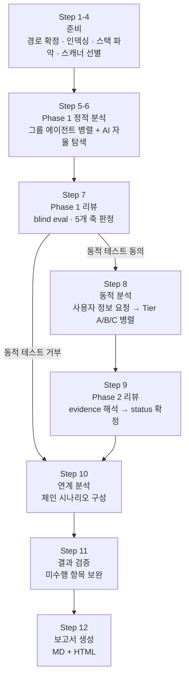

# Noah SAST 전체 스캔 흐름

소스코드를 입력받아 취약점 보고서를 생성하는 전체 파이프라인 개요.  
각 단계의 상세 절차는 `SKILL.md` 및 아래 링크된 개별 문서를 참조한다.

---

## 전체 흐름



---

## 단계별 요약

### 준비 (Step 1~4)

| Step | 하는 일 | 핵심 산출물 |
|------|---------|-----------|
| 1 | NOAH_SAST_DIR 경로 확정 | — |
| 2 | semgrep으로 전체 소스 패턴 인덱싱 | `PATTERN_INDEX_DIR/*.locindex.json` |
| 3 | 프로젝트 스택 파악 + 인증 경계 분석 | `auth-boundary.json` |
| 4 | 스캐너 선별 + 그룹 편성 + Tier 분류 | `_expected_scanners.json` |

semgrep 인덱싱을 1회만 실행해 저장하는 이유: 21개 그룹 에이전트가 병렬 실행되므로 각자 스캔하면 중복 비용이 발생한다.

---

### Phase 1 정적 분석 (Step 5~6)

| Step | 하는 일 | 핵심 산출물 |
|------|---------|-----------|
| 5 | 그룹당 1개 에이전트, 21개 그룹 병렬 실행. 각 에이전트가 locindex 읽고 소스 파일 Read하여 후보 판정 | `PHASE1_RESULTS_DIR/<scanner>.md` |
| 6 | AI 자율 탐색 에이전트가 패턴으로 잡히지 않는 취약점 보완 (비즈니스 로직, Race Condition 등) | `ai-discovery.md` |
| — | `phase1_build_master_list.py`가 전체 후보 집약 및 구조 검증 | `master-list.json` |

---

### Phase 1 리뷰 (Step 7)

Phase 1 에이전트가 Sink 패턴 중심으로 분석했다면, 리뷰는 Source 역추적 중심으로 독립 재판정한다.

- **blind eval**: Phase 1의 결론을 마스킹하고 리뷰 에이전트가 독립 판단
- **판정 3종**: CONFIRM(유지) / OVERRIDE(수정) / DISCARD(폐기)
- **게이트**: `phase1_review_assert.py`가 COVERAGE/OBLIGATION/FILE-PRESENCE 3종 검증

산출물: `evaluation/<scanner>-eval.md` (Phase 2 이후의 참조 기준)

---

### 동적 분석 (Step 8~9)

사용자가 sandbox URL과 세션을 제공하면 실제 HTTP 요청을 보내 취약점을 확인한다.

**Step 8-1**: 사용자에게 sandbox 도메인, 세션 쿠키, 동의 여부 요청  
**Step 8-2**: 도구 권한(`curl`, `python3` 등) 확인  
**Step 8-3**: Tier별 병렬 실행

| Tier | 특성 | 예시 |
|------|------|------|
| A | 인증 불요 | security-headers, http-smuggling, tls |
| B | 공유 세션 사용 | xss, sqli, ssrf, idor 등 대부분 |
| C | 독립 인증 컨텍스트 | oauth, saml, jwt |

**Step 9**: `phase2-review`가 evidence를 해석하여 `status`(확인됨/후보/안전)를 확정한다.

---

### 연계 분석 (Step 10)

후보가 2건 이상이면 취약점 간 연계 시나리오(공격 체인)를 분석한다. 체인 없으면 독립 후보 사유를 기록한다.

산출물: `chain-analysis.md`

---

### 결과 검증 (Step 11)

동적 테스트 수행 여부를 후보별로 체크리스트로 확인한다. 미수행 항목은 사유에 따라 재테스트하거나 "후보" 상태로 보고서에 포함한다.

---

### 보고서 생성 (Step 12)

```
scan-report 서브스킬
    └── 스캐너별 상세 섹션 서브에이전트 (병렬)
    └── assemble_report.py (섹션 조립)
    └── report-review (본문 품질 개선)
    └── report_finalize.py (HTML 변환 + 검증 + 브라우저 열기)
```

산출물: `noah-sast-report.md` + `noah-sast-report.html`

---

## 산출물 계보

```
PATTERN_INDEX_DIR/          ← semgrep 인덱싱 (Step 2)
    *.locindex.json
        ↓
PHASE1_RESULTS_DIR/         ← Phase 1 정적 분석 (Step 5~6)
    <scanner>.md
    ai-discovery.md
        ↓
master-list.json            ← 단일 진실 원천 (후보 전체 메타데이터)
        ↓
evaluation/<scanner>-eval.md  ← Phase 1 리뷰 (Step 7)
<scanner>-phase2.md           ← 동적 분석 증거 (Step 8)
        ↓
master-list.json (status/tag/evidence 갱신)  ← Phase 2 리뷰 (Step 9)
        ↓
chain-analysis.md           ← 연계 분석 (Step 10)
        ↓
noah-sast-report.md/.html   ← 최종 보고서 (Step 12)
```

---

## 단일 진실 원천

| 데이터 | 파일 | 최종 Writer |
|--------|------|------------|
| 후보 목록 초안 | `master-list.json` | `phase1_build_master_list.py` |
| Phase 1 판정 | `master-list.json`의 `phase1_*` 필드 | `phase1-review` 에이전트 |
| 최종 status | `master-list.json`의 `status/tag/evidence_summary` | `phase2-review` 에이전트 |
| Phase 2 증거 | `<scanner>-phase2.md` | Phase 2 에이전트 |
| 보고서 본문 | `noah-sast-report.md` | `assemble_report.py` + `report-review` |

---

## 관련 문서

| 문서 | 내용 |
|------|------|
| `docs/semgrep-indexing.md` | semgrep 인덱싱 동작 상세 |
| `docs/phase1-flow.md` | Phase 1 정적 분석 + 리뷰 + 게이트 3종 통합 흐름 |
| `docs/review-modes.md` | phase1/phase2/report-review 3모드 비교 |
| `docs/resume.md` | 중단 후 재개 판별 규칙 |
| `docs/single-source-of-truth.md` | 산출물별 writer/reader 상세 |
| `SKILL.md` | 메인 에이전트용 Step별 실행 절차 전문 |
