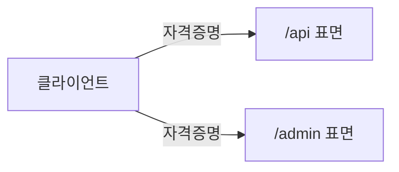
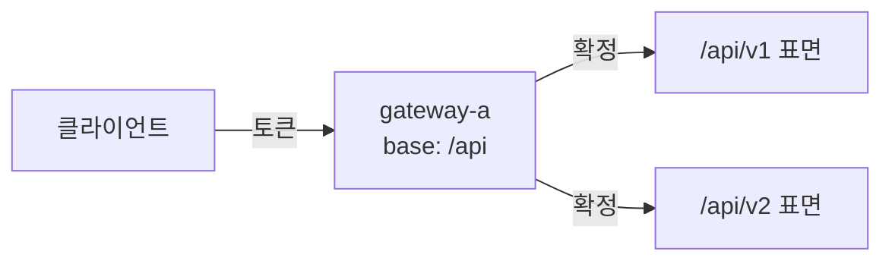
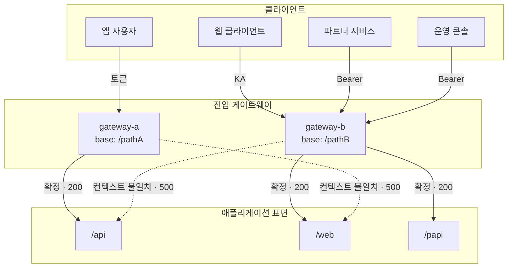

# 취약점 상세 형식 / 통합 보고서 구조 / 공통 HTML 사양

이 파일은 `scan-report/SKILL.md`에서 분리되었다. **scan-report Step 2의 서브에이전트**와 **scan-report Step 3(assemble_report.py) fallback**에서만 Read한다. 메인 에이전트는 이 파일을 직접 Read할 필요가 없다.

---

## 취약점 상세 형식

### 확인됨 형식

확인됨 항목은 아래 모든 섹션을 포함해야 한다.

```
### [번호]. [취약점 제목]

**ID**: [master-list.candidates[].id 값 — 예: OAUTH-1]
**유형**: [취약점 유형]
**상태**: 확인됨
**위치**: `파일경로:라인번호`
**진입 경계**: [진입 도메인][base path][경로] (인증: [자격증명 종류], 신원: [토큰/요청바디/요청헤더/내장자격증명/상호TLS·인증서/없음/미상], 인증 근거: [코드 근거/범위 밖], 도달성: [동적 확인 필요/확정]) — AUTH_BOUNDARY에서 이 후보 표면의 값. 다중 표면/도메인이 아니어도 항상 기재. 호스트는 `도달성=확정`일 때만 실제 도메인, 그 외엔 플레이스홀더
**Source**: 사용자 입력이 들어오는 지점
**Sink**: 이스케이프 없이 출력되는 지점

#### 원인 분석

취약점이 발생하는 이유를 코드 레벨에서 설명한다. 취약 코드 스니펫을 포함한다.

#### 재현 방법 및 POC

**Step 1: 취약 엔드포인트 식별**
소스코드 분석에서 식별한 Source→Sink 경로의 엔드포인트와 파라미터를 기재한다.

**Step 2: 페이로드 전송**
`<scanner>-phase2.md`의 `evidence.commands[]`(실제 실행한 curl)를 **그대로(verbatim) 복사**한다 — 재작성·요약·플레이스홀더 치환 금지. 세션 쿠키·URL·파라미터·페이로드를 실행값 그대로 둔다. (호스트는 `SANDBOX_DOMAINS`가 빈 값일 때만 `<TARGET_HOST>` 허용.)
예시(빈칸이 아닌 concrete 값으로 채운 *형태*를 보여줌). **아래 `sandbox.example.com`·`SESSION`/`CSRF`는 문서용 placeholder다 — 실제 보고서(확인됨/동적실행 항목)에는 이 예시값을 베끼지 말고 `evidence.commands[]`에 기록된 *진짜 실행한* sandbox 도메인·세션 쿠키·페이로드를 verbatim으로 넣는다.**
```
curl -X POST 'https://sandbox.example.com/api/.../endpoint?id=1024' \
  -H 'Cookie: SESSION=a1b2c3...; CSRF=x9y8...' \
  -d 'comment=<script>alert(document.cookie)</script>'
```

**Step 3: 결과 확인**
`evidence.responses[]`의 실제 응답에서 페이로드가 반영/유출된 부분을 그대로 인용한다(상태 코드·본문 발췌 포함).

#### 권장 조치

이 취약점을 수정하기 위한 구체적인 방법을 기재한다.
```

### 후보 형식

후보 항목도 확인됨과 동일한 상세도를 유지한다.

```
### [번호]. [취약점 제목]

**ID**: [master-list.candidates[].id 값 — 예: XSS-1]
**유형**: [취약점 유형]
**상태**: 후보 (추가 검증 필요)
**위치**: `파일경로:라인번호`
**진입 경계**: [진입 도메인][base path][경로] (인증: [자격증명 종류], 신원: [토큰/요청바디/요청헤더/내장자격증명/상호TLS·인증서/없음/미상], 인증 근거: [코드 근거/범위 밖], 도달성: [동적 확인 필요/확정]) — AUTH_BOUNDARY에서 이 후보 표면의 값. 다중 표면/도메인이 아니어도 항상 기재. 호스트는 `도달성=확정`일 때만 실제 도메인, 그 외엔 플레이스홀더
**미확인 사유**: [사유]

#### 소스코드 분석

취약해 보이는 코드 스니펫과 예상 공격 벡터를 설명한다. Source→Sink 데이터 흐름을 기재한다.

#### 재현 방법 및 POC

> **동적 실행된 후보**(무인증 IDOR 등 `<scanner>-phase2.md`에 `evidence.commands`가 있는 경우)는 "확인됨 형식"처럼 phase2.md의 실행 curl·응답을 **verbatim**으로 기재한다. 아래 플레이스홀더 형식은 **동적 미실행 정적 후보**에만 쓴다.

**Step 1: [단계 설명]**
소스코드 분석에서 식별한 엔드포인트와 파라미터를 기재한다.

**Step 2: 페이로드 전송 (정적 후보)**
구체적 curl로 작성하되, 호스트는 `SANDBOX_DOMAINS` 값 또는 (빈 값일 때) `<TARGET_HOST>`를 쓴다. 환경상 직접 획득 불가한 값(피해자 OTP·외부 콜백 URL 등)만 `<...>` 플레이스홀더를 허용한다. 엔드포인트·메서드·파라미터명·페이로드는 소스에서 확정한 실제 값으로 채운다.
```
curl -X <METHOD> "<TARGET_HOST>/<API_PATH>" -H "Cookie: <SESSION_COOKIE>" -d "<PARAM>=<PAYLOAD>"
```

**Step 3: 예상 결과**
취약점이 존재할 경우 예상되는 응답을 기술한다.

#### 권장 조치

이 취약점을 수정하기 위한 구체적인 방법을 기재한다.
```

### 이상 없음 형식

```
## 점검 항목 요약

| # | 점검 항목 | 위치 | 판정 | 근거 |
|---|----------|------|------|------|
| 1 | [검사한 패턴/코드 설명] | `파일경로:라인번호` | 안전 | [근거] |
| 2 | ... | ... | 안전 | ... |
```

---

## safe 판정 분류 (보고서 "안전 판정 항목" 섹션용)

`## 안전 판정 항목` 섹션은 safe 이유 유형별로 소분류한다. 내부 용어(§, mode명, "구조적 폐기", "Source 도달성" 등)는 제목에 쓰지 않는다.

### 분류 매트릭스

| 소분류 제목 | 정의 | 판정 모드 | 대표 근거 |
|-----------|------|----------|---------|
| 외부 접근 경로 없음 | 공격자가 해당 코드로 HTTP 요청을 보낼 수 없음 | phase1-review | dev-only 프록시, 서버 번들 비노출, 내부 전용 라우트 |
| 방어 계층 작동 확인 | 공격 페이로드를 실제 전송했으나 명시적 방어 코드가 차단 | phase2-review | nginx 차단, 프레임워크 이스케이프, 게이트웨이 재작성 |
| 취약점 성립 조건 미충족 | 공격 경로는 존재하나 취약점의 핵심 요건이 부재 | phase1-review 재호출 또는 phase2-review | 민감정보 0건, 공개 자원이라 보호 대상 아님 |
| 정적 분석 오탐 | Phase 1이 지적한 코드가 실제로는 취약점 sink가 아님 | phase1-review | 설정 지시자 오인, 방어가 다른 메커니즘으로 존재 |
| 최신 플랫폼 방어 | 대상 브라우저·런타임·HTTP 표준이 명시적으로 동등 효과 방어를 제공 | phase1-review | IETF RFC 기본 차단, 주요 브라우저 최근 2개 메이저 버전 기본값, 공식 폐기된 헤더/API, 표준 명세의 조용한 실패 |
| 아키텍처 근거 중복 | 다른 후보의 경로 증명용으로 기술된 독립 항목 | phase1-review | 상위 계층 결함의 영향 경로 증거, chain 근거 분리본 |

### 형식 템플릿

```
## 안전 판정 항목

### 외부 접근 경로 없음 (N건)

| ID | 제목 | 근거 |
|----|------|------|
| ID1 | [제목] | [구체적 근거] |

### 방어 계층 작동 확인 (N건)

| ID | 제목 | 방어 메커니즘 |
|----|------|-------------|
...

### 취약점 성립 조건 미충족 (N건)

| ID | 제목 | 부재하는 요건 |
|----|------|-------------|
...

### 정적 분석 오탐 (N건)

| ID | 제목 | 오탐 이유 |
|----|------|----------|
...

### 최신 플랫폼 방어 (N건)
### 아키텍처 근거 중복 (N건)
(위 2종은 각 소분류 표의 4번째 열을 각각 "동등 방어 근거" / "경로 증거 대상 후보"로 두고 동일 형식)
```

소분류에 해당하는 항목이 없으면 해당 소분류 자체를 생략한다.

### 독자 레이어 노출 금지 용어

보고서 제목·소제목·대시보드에는 다음 내부 규약 용어를 **절대 노출하지 않는다**:

- `§N` (내부 섹션 번호)
- mode명 (`phase1-review`, `phase2-review`, `report-review`)
- 내부 라벨 (`DISCARD`, `OVERRIDE`, `CONFIRM`, `Source 도달성 폐기`, `실질 영향 반증`)
- 스크립트명 (`phase2_review_assert.py` 등)

이들은 **근거 서술 본문에서 필요 시에만** 풀이와 함께 쓴다. 헤딩·카테고리 라벨로는 쓰지 않는다.

---

## 통합 보고서 구조

```markdown
# 통합 취약점 스캔 보고서

**대상**: [스캔 디렉토리명]
**스캔 일시**: [날짜]
**스캔 방식**: 소스코드 분석 + 동적 테스트
**테스트 환경**: [sandbox 도메인]
**스택**: 언어 :: Kotlin 2.1.21, Java 21 ;; 웹 :: Spring WebFlux ;; 스토리지 :: Redis ;; 메시징 :: Kafka
```

> 위 5개 필드만 개요에 사용한다. 이 목록은 `tools/lint_reader_layer.py`가
> 본 스펙(`scan-report/vuln-format.md`의 "통합 보고서 구조" 섹션 내
> 첫 번째 ```markdown 코드 블록)을 **단일 진실 원천으로 파싱**하여 lint
> 허용 집합으로 사용한다. 실제 보고서의 개요 필드 이름이 이 집합에
> 포함되지 않으면 lint가 차단한다.
>
> 추가 필드가 필요하면 먼저 본 스펙의 코드 블록에 `**<새 필드>**:` 줄을
> 추가하라. 그러면 lint가 자동으로 허용한다. 스펙 갱신 없이 보고서에
> 새 필드를 끼워 넣는 경로는 차단된다 — 독자 레이어에 내부 서술이
> 끼어들 여지를 원천 차단하는 구조.
>
> **[필수] `**대상**` 값에는 스캔한 디렉토리 이름(basename)만 쓴다.** 풀 경로
> (`/Users/.../mcqueen-develop`)·프로젝트 설명·분석 범위 서술·괄호 부연을 붙이지 않는다.
> 예: `**대상**: mcqueen-develop`. 디렉토리명은 `basename <PROJECT_ROOT>` 값이다.
> 프로젝트 식별자(패키지명 등)나 분석 범위·제외 모듈 같은 부연이 필요하면 개요 아래
> 별도 블록쿼트에 적는다 — 대상 뱃지에는 짧은 명사 하나만 들어가야 겹침·짤림이 없다.
> (렌더러는 방어적으로 값에 섞인 절대 경로를 basename 으로 축약한다.)
>
> `**테스트 환경**` 필드에 선언된 호스트는 본 보고서 내 모든 POC curl
> 명령어의 호스트와 일치해야 하며 (또는 `<TARGET_HOST>` 플레이스홀더 사용),
> `validate_report.py`의 URL 일관성 검증 기준이 된다.
>
> **[필수] `**테스트 환경**` 값에는 도메인·호스트 목록만 쓴다 (쉼표 구분).**
> `(prod 읽기 전용 확인)` 같은 서술·주석·괄호 설명을 붙이지 않는다 — 이 값은
> POC 호스트의 단일 진실 원천이라 서술이 섞이면 검증·치환이 깨진다. 환경 범위·
> 도달성 등 부연은 개요 아래 별도 블록쿼트나 해당 취약점 본문에 적는다.
> 동적 테스트를 수행하지 않은 경우에만 값으로 `해당 없음`을 쓴다.
> (`tools/lint_reader_layer.py`가 각 쉼표 토큰에 공백·괄호가 섞이면 서술로 보고
> 차단한다. 한글 IDN 도메인은 허용되며, `해당 없음`으로 시작하는 값만 예외.)
>
> **[필수] 동적 테스트를 수행한 보고서는 `**테스트 환경**`에 실제 호출 호스트만
> 둔다.** 실제로 호출한 호스트가 있으므로 `<TARGET_HOST>` 플레이스홀더나
> `해당 없음`을 쓸 이유가 없다 — 하나라도 섞이면 모순이다. `<TARGET_HOST>`·
> `해당 없음`은 동적 미수행(정적 후보만) 보고서 전용이다.
> (`validate_report.py` (e) 검사가 `스캔 방식`에 동적 테스트가 있는데
> `테스트 환경`에 플레이스홀더/`해당 없음`이 섞이면 경고한다.)
>
> **[필수] 부분 동적**(다중 표면 중 일부만 동적 수행)이면 `**테스트 환경**`에는
> `도달성=확정` 표면의 실제 도메인만 넣고, 미확정 표면의 `<TARGET_HOST>`는 본문 POC에만
> 두며 `테스트 환경` 필드에는 넣지 않는다 — 이러면 (e) 경고 없이 부분 동적이 정합하게 표현된다.
>
> **[필수] `**스택**` 값은 종류별로 그룹화한다.** 한 줄로 죽 나열하지 말고
> `종류 :: 항목, 항목 ;; 종류 :: 항목` 형식으로 쓴다. `;;`로 종류(카테고리)를
> 구분하고, `::`로 종류 라벨과 항목을 구분하며, `,`로 같은 종류의 항목을 구분한다.
> 종류는 대상에 맞게 자유롭게 정한다 (예: 언어 / 웹·프레임워크 / 스토리지 / 메시징 /
> 인프라 / 빌드). 렌더러가 종류별 행 + 항목 뱃지로 표현한다.
>
> **[필수] 각 항목(뱃지)에는 스택명만 넣는다.** 제품·기술 이름과(필요하면) 버전까지만
> 쓰고, 괄호 부연 설명·아키텍처 서술·문장(`다운스트림 마이크로서비스(HTTP)` 같은 표현)을
> 넣지 않는다 — 뱃지에는 짧은 명사만 들어가야 줄바꿈 시 중간에서 짤리지 않는다.
> 부연이 필요하면 개요 아래 별도 블록쿼트나 해당 취약점 본문에 적는다.
> 예: `언어 :: Kotlin 2.1.21, Java 21 ;; 웹 :: Spring WebFlux ;; 스토리지 :: Redis ;; 메시징 :: Kafka`

```markdown
---

## 총괄 요약

| 구분 | 건수 |
|------|------|
| 확인된 취약점 | N건 |
| 후보 (추가 검증 필요) | N건 |
| 스캔 완료 (이상 없음) | N개 스캐너 |
| 해당 없음 (미적용) | N개 스캐너 |

## 인증 경계

다음 두 표를 모두 포함한다 (AUTH_BOUNDARY = `auth-boundary.json` 기반, v11 schema).

**게이트웨이 표** (gateways[]가 1개 이상일 때만):

| 게이트웨이 | host 패턴 | base path | 비고 |
|----------|-----------|-----------|------|
| ... | ... | ... | ... |

**클라이언트 표** (clients[]가 1개 이상일 때만):

| 클라이언트 | 페르소나 | 자격증명 |
|----------|---------|---------|
| ... | ... | ... |

**경로 표** (routes[] — 항상 작성):

| 표면 (surface_key) | 게이트웨이 | 클라이언트 | 자격증명 체인 | 신원 출처 | 인증 근거 | 도달성 | 실패 모드 |
|------------------|----------|-----------|-------------|----------|----------|--------|----------|
| ... | ... | ... | ... | 토큰/요청바디/요청헤더/내장자격증명/상호TLS·인증서/없음/미상 | 코드 근거/범위 밖 | 동적 확인 필요/확정 | gateway_basepath_mismatch / credential_mismatch / missing_auth_header / downstream_propagation |

**Mermaid 흐름도** — 다음 중 하나라도 만족하면 작성 (v11 게이팅): `len(routes) >= 2` OR `len(clients) >= 2` OR `len(gateways) >= 2`. 그렇지 않으면 생략 (빈 흐름도 금지).

흐름도 표기 규칙:
- subgraph로 클라이언트/게이트웨이/표면 3-tier 분리
- edge label에 자격증명 + (확정 시) 응답 코드
- 실선(`-->`)=`도달성=확정` 정상 경로, 점선(`-.->`)=`동적 확인 필요` 또는 실패 모드
- 게이트웨이→표면 비대칭(`gateway_basepath_mismatch`)은 점선 + label로 명시

토폴로지별 3종 예시:

**1) Monolith** (게이트웨이 없음):


**2) Single-gateway**:


**3) Multi-gateway** (다중 클라이언트 페르소나):


변형: GraphQL federation·service mesh sidecar는 게이트웨이 노드 분할 또는 sidecar 노드 추가로 표현. multi-tenant SaaS는 클라이언트 페르소나 다중화로 표현.

**[필수] mermaid 노드/서브그래프 라벨 표기 규칙 (작성 함정):**
- 라벨이 다음 중 하나라도 포함하면 반드시 큰따옴표(`"..."`)로 감싼다: 슬래시(`/`), 콜론(`:`), 괄호(`(`/`)`), 파이프(`|`), `<br/>`·`<br>` 등 HTML 태그, 한글 외 특수문자.
- 특히 `[/...]` 형태는 mermaid 11.x에서 평행사변형 도형 문법(`[/text/]`)으로 오인되어 syntax error 발생.
- 안전 기본값: **모든 노드/서브그래프 라벨을 따옴표로 감싸는 것을 기본 정책**으로 한다.
- edge label(`-->|...|`)은 파이프 안이므로 따옴표 불필요하나, 라벨에 파이프(`|`)·줄바꿈이 들어가야 한다면 다른 형태로 변형(예: `·`로 구분).

POC 호스트 규칙:
- `도달성=확정`인 게이트웨이만 실제 호스트 인라인. 그 외(`동적 확인 필요`·`미상`)는 플레이스홀더.
- `도달성=확정`인 진입 도메인은 모두 개요 `**테스트 환경**` 필드에 포함 (`validate_report.py` 호스트 일관성 검증과 정합).

## 취약점 요약 테이블

| # | ID | 취약점 제목 | 유형 | 스캐너 | 상태 |
|---|----|------------|------|--------|------|
| 1 | XSS-1 | callback 파라미터 XSS | XSS | xss-scanner | 확인됨 |
| 2 | OAUTH-1 | OAuth state 검증 미흡 | OAuth | oauth-scanner | 후보 |
| ... | ... | ... | ... | ... | ... |

<!-- CHAIN_SECTION_HERE -->

## 스캐너별 실행 결과

### XSS Scanner
[확인됨 N건 / 후보 N건]

(각 취약점 상세 — 확인됨/후보 모두 동일한 상세도로 작성)

### SSRF Scanner
[이상 없음]

(점검 항목 요약 테이블)

### SQL Injection Scanner
[해당 없음 — ORM만 사용, Raw Query 없음]

...

## AI 자율 탐색 결과

<!-- AI_DISCOVERY_SECTION_HERE -->

## 미적용 스캐너 목록

| 스캐너 | 미적용 사유 |
|--------|-----------|
| ldap-injection-scanner | LDAP 라이브러리 미사용 |
| ... | ... |
```

## 보고서 섹션 구조 (헤딩 스펙)

보고서에 등장하는 모든 헤딩(`#` ~ `######`)은 아래 정의된 집합에서만 허용된다.
`tools/lint_reader_layer.py`가 본 섹션을 **단일 진실 원천**으로 파싱하여
허용 패턴을 컴파일하고, 실제 보고서의 헤딩이 어느 패턴에도 매칭되지 않으면
차단한다. 코드 블록 내부의 `#`로 시작하는 주석은 헤딩이 아니므로 lint가 스킵.

신규 헤딩이 필요하면 먼저 본 섹션에 추가한다. lint가 다음 실행 시 자동 반영.

### 고정 헤딩 (정확한 문자열만 허용)

```
# 통합 취약점 스캔 보고서
## 개요
## 총괄 요약
## 인증 경계
## 취약점 요약 테이블
## 연계 시나리오
## 스캐너별 실행 결과
## AI 자율 탐색 결과
## 안전 판정 항목
## 이상 없음 스캐너 점검 항목 요약
## 미적용 스캐너 목록
## 부가 발견
### AI 자율 탐색
### 독립 후보
### 외부 접근 경로 없음
### 방어 계층 작동 확인
### 취약점 성립 조건 미충족
### 정적 분석 오탐
### 최신 플랫폼 방어
### 아키텍처 근거 중복
#### 원인 분석
#### 소스코드 분석
#### 재현 방법 및 POC
#### 권장 조치
#### 공통 권장 조치
```

### 템플릿 헤딩 (동적 부분 포함)

```
### {SCANNER_NAME} Scanner
#### 공통 권장 조치 ({IDS} 일괄 적용)
### 외부 접근 경로 없음 ({N}건)
### 방어 계층 작동 확인 ({N}건)
### 취약점 성립 조건 미충족 ({N}건)
### 정적 분석 오탐 ({N}건)
### 최신 플랫폼 방어 ({N}건)
### 아키텍처 근거 중복 ({N}건)
### 체인 #{N}: {TITLE}
#### {N}. {VULN_TITLE}
```

템플릿 변수 정의:

| 변수 | 정규식 |
|------|--------|
| `{N}` | `\d+` |
| `{IDS}` | `[A-Z][A-Z0-9_]*-\d+(\s*~\s*[A-Z][A-Z0-9_]*-\d+)?` (단일 ID 또는 ID 범위, 예: `CSVI-1 ~ CSVI-10`) |
| `{SCANNER_NAME}` | `[A-Za-z0-9가-힣/][A-Za-z0-9가-힣/\s\-]*` (공백/하이픈 포함 가능, 첫 글자는 알파벳/한글/숫자) |
| `{VULN_TITLE}` / `{TITLE}` | `.+` (자유 텍스트) |

---

### 통합 HTML 보고서 추가 요소

- **총괄 대시보드**: 확인됨/후보/이상 없음/미적용 건수를 한눈에 보여주는 요약 카드
- **스캐너별 결과 섹션**: 각 스캐너의 결과를 접을 수 있는(collapsible) 섹션으로 표시
- **앵커 링크**: 요약 테이블에서 클릭하면 해당 스캐너 섹션으로 이동

---

## 공통 HTML 보고서 사양

모든 HTML 보고서는 다음 사양을 따른다:
- 단일 파일 정적 HTML (코드·데이터 인라인). 단 웹폰트·mermaid 흐름도 렌더 라이브러리는 CDN(jsdelivr) 로드를 허용한다 — `## 인증 경계` 흐름도가 있을 때 `md_to_html.py`가 ` ```mermaid ` 블록을 `<div class="mermaid">`로 변환하고 mermaid.js를 로드한다
- 인라인 CSS로 스타일 포함
- 취약점 목록을 한눈에 볼 수 있는 요약 테이블
- 각 취약점 상세 섹션 (원인 분석, POC, 응답 증거)
- 코드 블록에 구문 하이라이팅 스타일 적용
- 요약 테이블에서 상세 섹션으로 이동하는 앵커 링크

**앵커 링크와 collapsible 섹션 연동 (필수):**

취약점 상세(`id="vuln-N"`)가 `<details>` 내부에 위치하므로, `<details>`가 닫힌 상태에서는 브라우저 네이티브 앵커 스크롤이 동작하지 않는다. 이를 해결하기 위해 `</body>` 직전에 다음 JavaScript를 반드시 포함한다:

```html
<script>
document.addEventListener('click', function(e) {
  var a = e.target.closest('a[href^="#vuln-"]');
  if (!a) return;
  var id = a.getAttribute('href').slice(1);
  var target = document.getElementById(id);
  if (!target) return;
  var details = target.closest('details');
  if (details && !details.open) {
    details.open = true;
  }
  setTimeout(function() { target.scrollIntoView({behavior: 'smooth'}); }, 50);
});
</script>
```
